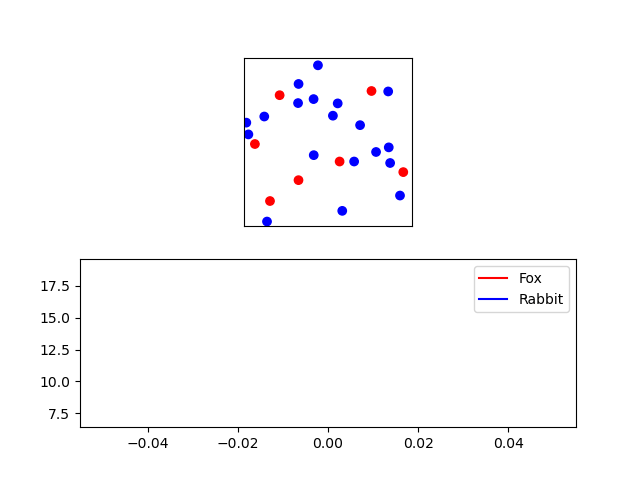

# Populations introduction

We want to know how a population of foxes and rabbits interact with each other. Specifically: *How do birth rates influence the population*.

## Background

A famous mathematical description of the interactions in the predator-prey model are the [Lotka-Volterra equations](https://en.wikipedia.org/wiki/Lotka–Volterra_equations). It is not important to know or understand these equations for this assignment. But if you're curious, here they are:

$$\begin{align*}
\frac{dx}{dt} &= \alpha x - \beta x y \\
\frac{dy}{dt} &= \delta x y - \gamma y
\end{align*}
$$

Where $x$ is the number of prey, $y$ is the number of predators, $t$ is time, and the other variables describe the interactions between species. Since this is a mathematical model and not the real world, the population of a species is allowed to be a floating point number.

We're not doing mathematics, but computer programming. So what we will do is simulate the behavior of predators (foxes) and prey (rabbits). Of course, we will have to make a lot of simplifying assumptions to do so. In this assignment, you will iteratively build up the system. We'll start with something simple (a moving dot) and build it out to something more complex and interesting. The resulting model can be considered a [complex system](https://en.wikipedia.org/wiki/Complex_system#:~:text=Complex%20systems%20are%20systems%20whose,given%20system%20and%20its%20environment.). As such, you can rely on analyses that are common in that field such as [sensitivity analysis](https://en.wikipedia.org/wiki/Sensitivity_analysis).

## General goal

The simulation below shows the interaction between rabbits (blue) and foxes (red). They can both reproduce if they meet a creature of the same species. And the foxes can grow hungry, if they eat a rabbit, they can continue for longer. If they can't find a rabbit to eat they will eventually die.

{: width="80%"}

As you see the foxes in this simulation use up all their resources (rabbits), which leads to the collapse of their ecosystem and eventually their demise. You're going to find out if this can be prevented.

The simulation has a lot of moving (harr) parts. And is too complex to build in one go. In such cases, it is good practice to start with something simple and gradually build it out to the desired result.

For the first part of this module, we will specify exactly how to make an increasingly complex class structure in 9 phases. This might feel a bit restrictive, but it is a good way to learn how you can build complex object-oriented projects.

## Overview

The experiment is essentially a [multi-agent system](https://en.wikipedia.org/wiki/Multi-agent_system). A multi-agent system consists of agents that can move around and interact. Any multi-agent system will have to implement several features:

* There should be a world for the agents (the rabbits and foxes) to exist in. In our case, this is simply a space of dimensions 1 by 1. The dimensions don't have a particular meaning, but you can imagine them as kilometers.
* The agents have to be able to move around.
* The agents have specific personal behavior. For example, the foxes will get hungry.
* The agents can interact: Foxes can eat rabbits and all creatures can reproduce.

In phase 1 of the experiment, you'll set up the world and create a rabbit agent. Phases 1 - 5 are about creating the agents and having them move around. In phase 6 you'll implement the fox's specific behavior (hunger). Up to this point, there is no interaction between agents. This interaction you'll implement in phases 7 - 9. You will then proceed with gathering data on the dynamics of our model with different input parameters. Finally, you will propose and answer your own research question on the created model.
