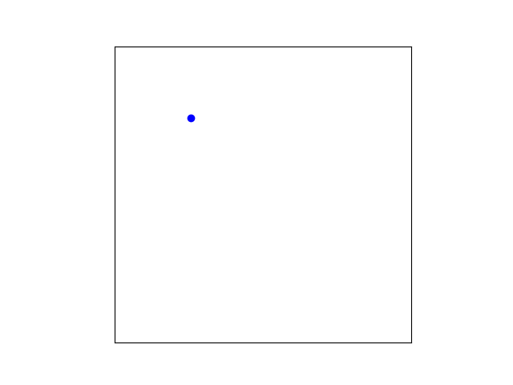
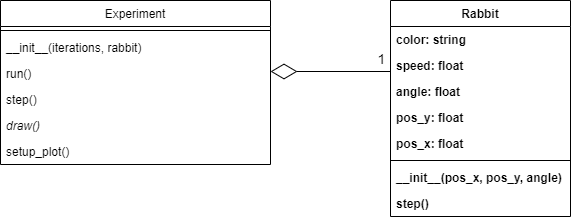

# Populations phase 1: rabbit

Start by downloading the file [phase1.py](phase1.py). This will be the starting point for this assignment.

### Goal
Let's start by having a single rabbit move over the screen. Like in the example below.

{: width="60%"}

The blue dot represents a rabbit and it follows a straight path at an angle. When it hits the border it turns 180 degrees around.

### Provided code

The file `phase1.py` you downloaded contains the `Experiment` class. This class contains the main functionality for plotting and managing the experiment you're about to make. In this assignment, you will iteratively extend the functionality of this class and add other classes.

The main code (below the `Experiment` class) creates a new rabbit with a specific position in the field ($$0.25$$, $$0.75$$) and a specific angle of movement ($$\pi/4$$). Then, a new experiment is created with a limit of 100 iterations and containing the created rabbit. And, in the last step, the experiment is run for $$100$$ iterations. All done by these three lines:

    my_rabbit = Rabbit(0.25, 0.75, math.pi/4)
    my_experiment = Experiment(100, my_rabbit)
    my_experiment.run()

> You might wonder why the following statement is in the code: `if __name__ == "__main__":`. In short: it allows you to execute code when the file is run directly, but not when it’s imported. This way, it is possible to write (and keep!) code that tests your implementation in the program without having to run it every time when the code is used in other places.

Running this program would show the moving blue dot (the rabbit), were it not that you still have to implement the `Rabbit` class. The relation between the `Experiment` and `Rabbit` class is displayed in the following [UML](https://en.wikipedia.org/wiki/Unified_Modeling_Language) diagram:

{: width="70%"}

In this diagram, you see that an object of the class `Experiment` contains exactly one object of the class `Rabbit`. This is shown by the line that starts with the diamond shape (⬦---) and has the `1` written next to the `Rabbit` class. The diamond shape denotes aggregation (i.e., "contains") and the number denotes how many. So this translates to: "an experiment contains one rabbit".

The UML diagram also shows the methods and attributes that the classes should have.

For convenience, we've made everything that you still have to implement **bold** and everything that needs to be modified *italic*.

### Specification
So what you get is most of the class `Experiment`. This class contains the following:

* The method `__init__(iterations, rabbit)`. This is called when you create a new experiment. When you create a new experiment you have to give it a number of `iterations` to run and a `Rabbit` object as its arguments.
* The method `step()`. This will call the `step()` method of the rabbit, having it update its location based on its speed and angle.
* The method `run()` with the optional argument `iterations`. This will run the simulation/experiment by calling `step()` and `draw()` successively an `iterations` number of times. If `iterations` is not given by the user, the default value is retrieved from the value stored in `self.iterations`.
* The method `setup_plot()`. This is called by `__init__()` and configures matplotlib for this experiment.

For the class `Experiment` you still have to:

* *modify* the method `draw()`. This will draw the blue dot at the location of the rabbit. This is not finished yet. You'll have to add the code to actually draw the rabbit. (Tip: you can use the matplotlib method `self.ax1.scatter(...)` for this.)

You also have to implement the class `Rabbit`:

* **add** class `Rabbit`
* **add** method `__init__(pos_x, pos_y, angle)`: As for all classes, the `__init__` method is automatically called when creating a new `Rabbit` object. When creating a new `Rabbit` object, you have to provide the position and angle. The init method should assign the position and angle parameters to the appropriate attributes. The init method should also set the default values for the attributes `speed` and `color`.
  * **add** attribute `pos_x`, `pos_y`: The position of the rabbit. These are values between $$0$$ and $$1$$, where $$0, 0$$ is the left-bottom corner of the field and $$1, 1$$ is the right-upper corner.
  * **add** attribute `angle`: The angle at which the rabbit will move. An angle of $$0$$ makes the rabbit move along the x-axis and an angle of $$\pi /2$$ makes the rabbit move along the y-axis.
  * **add** attribute `speed`: The speed at which the rabbit moves every step of the simulation should be set to $$0.01$$.
  * **add** attribute `color`: The color for displaying the rabbit in the plot. Rabbits get the color `'blue'`.
* **add** method `step()`: Run a single step of the simulation for the rabbit; this should update the position of the rabbit.
    The rate of change ($$dx$$ and $$dy$$) is given by the formulas:

    $$\begin{align*}
    dx &= \textrm{cos}(\textrm{angle}) \cdot \textrm{speed} \\
    dy &= \textrm{sin}(\textrm{angle}) \cdot \textrm{speed}
    \end{align*}
    $$

    We can use these values to update the $$x$$ and $$y$$ positions:

    $$
    \begin{align*}
    \textrm{pos\_x} &= \textrm{pos\_x} + dx \\
    \textrm{pos\_y} &= \textrm{pos\_y} + dy
    \end{align*}
    $$

    *There is a very important (literal) edge case: When the rabbit reaches the edge of the field (its x or y location would become smaller than 0 or bigger than 1), it should not change its position but instead turn around (i.e., increase the angle by $$\pi$$).*

> Note: None of the methods mentioned above and shown in the UML contain the `self` parameter, this is left out (as is conventional in UML diagrams) but you always have to add this parameter in your code. So when you create the method `__init__(pos_x, pos_y, angle)`, it should be defined as `def __init__(self, pos_x, pos_y, angle):`. The same goes for the method `step()`: `def step(self):`.

> Tip: The number of iterations of the experiment is set to 100 in the example code. It might save you a lot of time to set this to some very small number (like 5) in the beginning, and only when that seems to work set it back to 100. That way you don't have to wait so much every time you're trying to run your code.

### Test

Test what you've done so far. Is the rabbit moving?

Here are some test cases you can use:

* Set the angle to $$0$$. Does the rabbit follow the x-axis?
* Set the angle to $$\pi$$ (`math.pi`). Does it go in the opposite direction?
* Set the angle to $$1/2 \pi$$. Does the rabbit follow the y-axis?
* Increase the speed from $$0.01$$ to $$0.02$$. Does the rabbit seem to move twice as fast?
* Set the speed of the rabbit to $$0$$. Does it stay still?

### Checkpy

    checkpy phase1

> Remember to set all values back to their defaults after testing!
