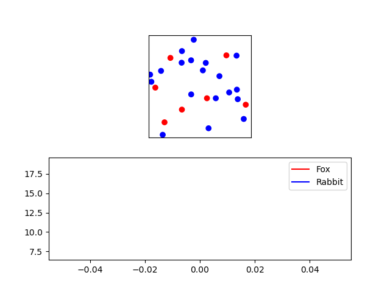

## Experiment: Population dynamics

### Goal

{: width="80%"}

The simulation above was run with a birthrate of `0.15` for both rabbits and foxes. As you can see, the population of rabbits is not stable. The rabbits die out at around iteration 100. We would like to run a set of experiments and find out what the effect of different combinations of parameters is on the population of both rabbits and foxes.

Since our simulation is probabilistic and highly chaotic, we can not guarantee that the outcome of a single run is a good representation of the actual dynamics of the simulation. To get a good overview of the outcome of our experiments we will have to run them many times and analyze the results.

In this phase of our experimentation pipeline we will write the code that runs experiments with varying input parameters multiple times. More specifically, we will run the simulation with different combinations for the birthrate of rabbits and foxes. The generated results for each experiment are then written to several `csv`-files in a `data/` folder for future analysis. Each `csv`-file contains the outcome of a multitude of runs of experiments done with the same input parameters.

### Setup

First, we will write code that can run an experiment with a specific configuration multiple times and record the results to a `csv`-file. We have provided you with some code that should help you in this process which you can [download here](experiment.py).

The code provided imports the `Experiment` class from your final implementation (`phase9.py`) and provides you with a dictionary named `experiment_kwargs` defining the default set of parameters that we will use for our experiments. We've also defined two functions for you that will make it a bit easier to collect and store your data.

`generate_experiment_name()` is a function that can be used to generate filenames for your experiments. By using this function the name of the `csv`-file will be more descriptive, and manually finding data for experiments done with a specific configuration will be easier. The function accepts a single argument which should be a dictionary formatted like `experiment_kwargs`.

`export_result_to_csv()` is the function you will use to store the results of your experiments. It accepts three arguments; the location where the data should be stored, the configuration of the experiments, and the results of those experiments.

### Specification

#### Repeat one experiment configuration `N` times

Write code that runs `N` experiments with the given experiment configurations in `experiment_kwargs`. `results` should be filled with tuples, where every tuple indicates the number of rabbits and foxes at the end of an experiment. You can use `Experiment`'s `count_creatures()` method to get each tuple.

To test your code, try a lower value for `N` first, and look at the generated `csv`-file. Does it contain the values you expected?

#### Repeat many experiment configurations `N` times

Modify your code to run experiments with every possible configuration of `birthrate` for rabbits and foxes. Your code should run the experiment with each combination of birthrates for rabbits and foxes from 0.05 to 0.5, incrementing by 0.05.

To do this, you can use a loop to iterate through the different values of birthrate for rabbits and foxes. For each combination of birthrates, you should run `N` experiments and export the results of each individual configuration using `export_result_to_csv()`.

If done properly, after some time, you should end up with 100 different `csv`-files containing `N` results each.
