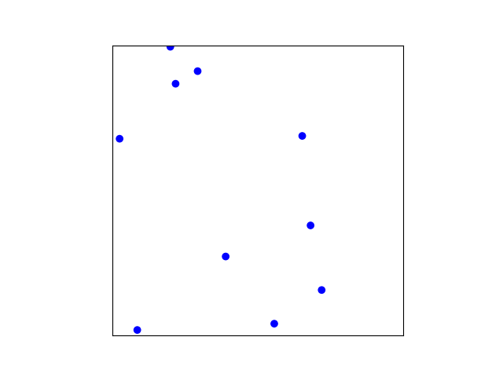
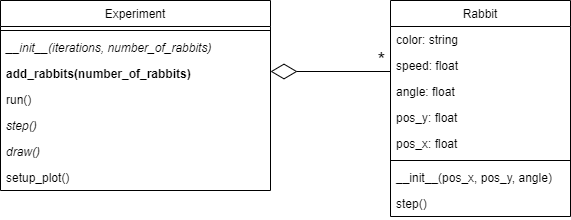

## Phase 2: Rabbits

Before you continue, **make a copy of your previous file and call it `phase2.py`**. Make sure to **continue editing this new file**.

### Goal

A single rabbit moving around is a bit boring, let's add some more. Like so:

{: width="60%"}

The great thing about using classes is that we can make multiple instances of a specific class. So we can add multiple rabbits without modifying the `Rabbit` class and with only small modifications to the `Experiment` class.

After your changes the UML should look like this:

{: width="70%"}

The fact that `Experiment` can contain any number of rabbits is indicated by the `*` near the `Rabbit` class on the aggregation line. In the UML everything that is bold is new (and is up to you to implement). So here you'll have to add the method `add_rabbits(number_of_rabbits)`. Everything in italic is not new, but you will have to modify it to make things work.

### Specification

For this phase you have to *modify* the class `Experiment` as follows:

* *modify* attribute `rabbit` (of type `Rabbit`) to `rabbits` (of type `List`).
* **add** method `add_rabbits(number_of_rabbits)` that creates a list of rabbits with random locations and angles and adds them to the attribute `rabbits`.
* *modify* `__init__(iterations, number_of_rabbits)` to accept the new parameter `number_of_rabbits` and use `add_rabbits()`.

    **From here on the `Rabbit` objects will be created *inside* the `Experiment` object.** We don't have to do this in the main code anymore as we did in Phase 1.

* *modify* method `step()` to call the `step()` method of *all* rabbits.
* *modify* method `draw()` to draw *all* rabbits. *Tip: don't use a loop for calling `self.ax1.scatter(...)` many times as this will make your code very slow. Try to collect all the coordinates to plot first and call `self.ax1.scatter(...)` only once to plot all the rabbits in one go.*

The experiment should spawn 10 rabbits when called like this:

    my_experiment = Experiment(100, 10)
    my_experiment.run()

> Don't forget the `self` parameter when you define new methods.

### Test

Make sure your experiment works with 1 rabbit:

    my_experiment = Experiment(100, 1)
    my_experiment.run()

Make sure your experiment works with 100 rabbits:

    my_experiment = Experiment(100, 100)
    my_experiment.run()

And, with 0 rabbits:

    my_experiment = Experiment(100, 0)
    my_experiment.run()
