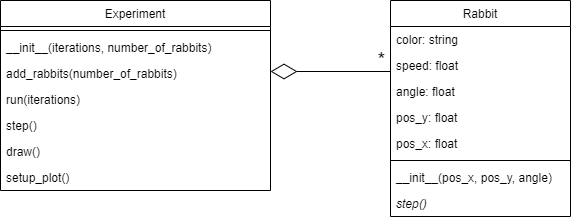

## Phase 3: More natural movement

Before you continue, **make a copy of your previous file and call it `phase3.py`**. Make sure to **continue editing in this _new_ file**.

### Goal

The rabbits' straight-line pathing does not feel particularly natural. To inject a sense of unpredictability into their movements, we will incorporate occasional changes in direction. Like this:

{: width="60%"}

The resulting UML will be the same as in the previous step. You don't need to add any classes or methods. You'll just have to modify `step()` slightly.

{: width="70%"}

### Specification

*Modifications* to the class `Rabbit`:

* *modify* method `step()` to get the rabbit to change `angle` regularly. _Before moving_, the rabbit should have a $$20\%$$ probability to *update* its angle with a random value between $$-\pi/2$$ and $$\pi/2$$ (i.e., between $$-90$$ and $$+90$$ degrees). This is the change of angle _relative_ to the current `angle`. Remember: the possible update of the `angle` should be done *before* taking a step.

### Test

Here are some useful test cases.

* Do the rabbits seem to move around more naturally (similar to the example animation above)?
* Set the probability to update to $$0\%$$ (so the angle should never change). Are the rabbits moving in a straight line?
* Set the probability to update back to $$20\%$$ but alter the random angle change values to be between $$0$$ and $$0$$ (so the angle shouldn't change). Are the rabbits moving in a straight line? (If they are all moving exactly along the x-axis, something is wrong.)

### Checkpy

No checkpy for this phase.
