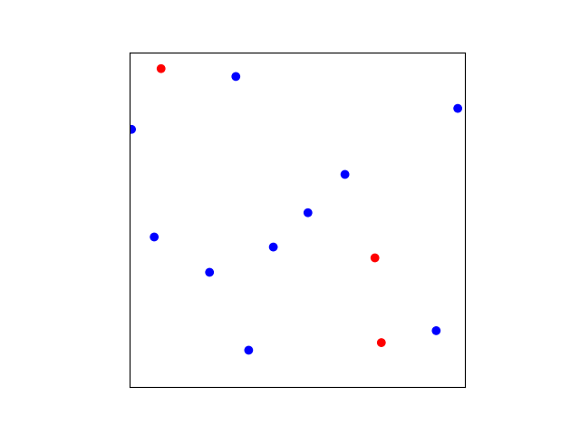
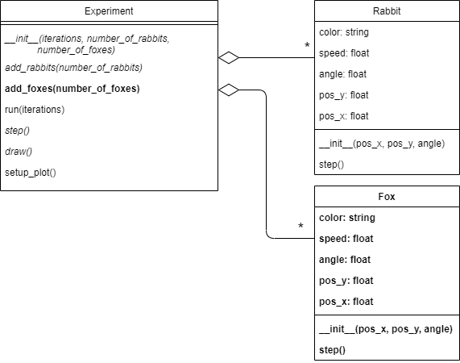

## Phase 4: Foxes

Before you continue, **make a copy of your previous file and call it `phase4.py`**. Make sure to **continue editing in this new file**. It is important to keep the previous file as is. For this module, you'll have to submit all the stages separately.

### Goal

Let's add the foxes to the experiment. For now, they're just going to walk around and not bother any rabbits. Foxes are in many ways similar to rabbits, they have a position and an angle and they move around. But their movements are slightly different. They go faster and they make slower turns. We will give foxes the color red. The new simulation will look like this:

{: width="60%"}

This will require a whole new class `Fox` as you can see in the UML:

{: width="70%"}

You see that the class `Experiment` can contain any number of instances of `Fox` (as indicated by the `*`).

### Specification

For the class `Fox`:

* **add** class `Fox`. For now, it has the same properties as the `Rabbit`, only the speed and color have different values.
* **add** attributes `pos_x`, `pos_y`.
* **add** attribute `angle`.
* **add** attribute `speed`. The speed of the fox should be $$0.03$$ (faster than the rabbit).
* **add** attribute `color`. Foxes get the color `'red'`.
* **add** method `__init__(pos_x, pos_y, angle)`.
* **add** method `step()`. The steps are the same as for `Rabbit` only the change of angle is less abrupt: the angle has a $$20\%$$ probability of changing by a random value between $$-\pi/4$$ and $$\pi/4$$ (i.e., between -45 and 45 degrees).

For the class `Experiment`:

* *change* attribute `rabbits` to `creatures`. This list will now contain both foxes and rabbits.
* **add** `add_foxes(number_of_foxes)` this should add foxes to the list of creatures.
* *modify* `__init__(iterations, number_of_rabbits, number_of_foxes)`. The method should now get an additional parameter for the number of foxes. And it should call the method `add_foxes()`.
* *modify* `add_rabbits(number_of_rabbits)` to add the Rabbit instances to the list `creatures` instead of to `rabbits`.
* *modify* `step()` to use the list `creatures` in stead of `rabbits`.
* *modify* `draw()` to use the list `creatures` in stead of `rabbits`.

The experiment should spawn 10 rabbits and 3 foxes when called like this:

    my_experiment = Experiment(100, 10, 3)
    my_experiment.run()

### Test

Do the foxes seem to move faster than the rabbits?

Think about how you can test if everything works as expected. Test at least a few different configurations.

For example, an experiment without foxes:

    my_experiment = Experiment(100, 10, 0)
    my_experiment.run()

an experiment without rabbits:

    my_experiment = Experiment(100, 0,3)
    my_experiment.run()

an experiment without any creature:

    my_experiment = Experiment(100, 0, 0)
    my_experiment.run(100)

Change the parameters of the fox and see if you have the expected behavior. What happens when you make the angle of change of the foxes 0? What happens when you set their speed to 0? Is this what you would expect?
