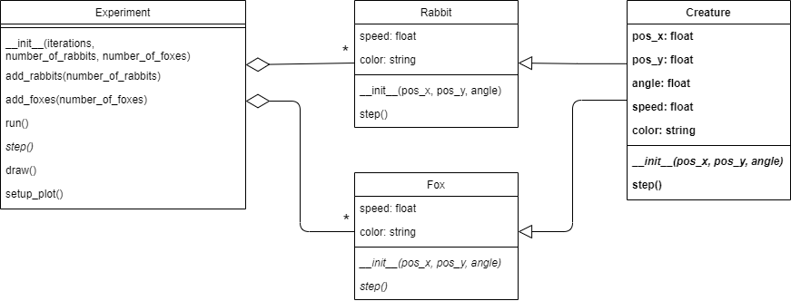

## Phase 5: Creatures

Before you continue, **make a copy of your previous file and call it `phase5.py`**. Make sure to **continue editing in this new file**. It is important to keep the previous file as is. For this module, you'll have to submit all the stages separately.

### Goal
Before adding more complexity again in the next phase, let's now focus on making the code a bit nicer.

As you might have realized by now, for the previous phase you created a lot of duplicate code. The class `Fox` and `Rabbit` have a lot of overlap. Not that surprising, since a big part of the code for both classes has to do with them being creatures that walk around in this simulated world.

So let's create a new abstraction: You're going to create a superclass called `Creature`. This class will contain the code for moving around that both `Fox` and `Rabbit` will inherit.

The UML will look like this:

{: width="100%"}

Notice that class inheritance is indicated by arrows (⇽). So `Fox` and `Rabbit` both inherit from `Creature`. You can also see that `Fox` and `Rabbit` are reduced a lot as most of their code will now reside in `Creature`.

### Specification

Create a new class called `Creature`. For this class:

* **add** method `__init__(pos_x, pos_y, angle)`.
  * **add** attributes `pos_x`, `pos_y`.
  * **add** attribute `angle`.
  * **add** attribute `speed`. Creatures get the default speed $$0.01$$.
  * **add** attribute `color`. Creatures get the default color `'black'`.
* **add** method `step()`. This method should only define the step based on the current angle, position and speed. It should not define the change of angle as that part is defined in the `step()` methods of the subclasses `Rabbit` and `Fox`

Modify the `Fox` class. You can remove a lot of code and inherit it from `Creature`.

* *modify* class `Fox`. The class definition should now be changed to inherit from `Creature`.
* *modify* method `__init__(pos_x, pos_y, angle)` to call the `__init__()` method from the superclass (using `super()`). After this, you should still specify `speed` and `color` in this class as those properties are particular to `Fox`.
* *modify* method `step()` to call the same method from the superclass. Only the modification of the angle should remain in this class (as the logic for changing angles is particular to the `Fox` class).

Modify class `Rabbit` in the same way as `Fox`.

### Test

This was only a design change. If you did it correctly, it shouldn't have changed any of the behavior of the experiment. Test this by using some of the test cases from the previous phases. Pay special attention if the movement behavior of the fox is still independent of that of the rabbit. Can you, for example, change the speed of the foxes without changing the speed of the rabbits?
