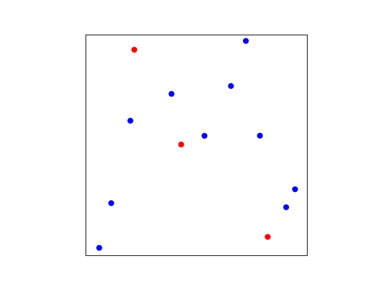
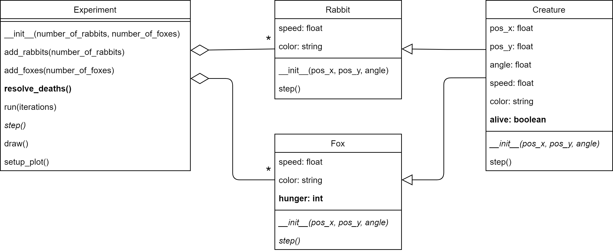

## Phase 6: Starving foxes

Before you continue, **make a copy of your previous file and call it `phase6.py`**. Make sure to **continue editing in this new file**. It is important to keep the previous file as is. For this module, you'll have to submit all the stages separately.

### Goal

We need to give the foxes a reason to eat the rabbits, so let's make them hungry. We'll assume that hunger just linearly increases over time and that when Foxes are too hungry they die. Like so (notice the red dots disappearing):  

{: width="60%"}

The red dots disappear all at once because the foxes all come into existence at the same time, they get hungry at the same rate, and they cannot feed yet (we have not implemented that part yet), so the foxes all tragically die of hunger at the exact same time.

As you can see in the UML below, you will have to add some methods and attributes that have to do with managing creatures being alive or not and foxes being hungry:

{: width="100%"}

Note that we chose to make being alive or not to be a property of `Creature`, not just of `Fox`. This is because we know that in a future phase rabbits can also die, so we might as well make being alive or not a property of all creatures. Hunger, on the other hand, is modelled as a property of only foxes as, at least for now, we will assume that rabbits don't need to eat.

### Specification

Modify the class `Creature`:

* *modify* method `__init__()`.
  * **add** attribute `alive`. This boolean registers if a creature is alive or not. Set the value of `alive` to `True`.

Modify the class `Fox`:

* *modify* method `__init__()`.
  * **add** attribute `hunger`. This is an integer indicating the degree of hunger of the fox (0 means no hunger at all). Set the value to `0`.
* *modify* method `step()` to increase hunger by 1 at every step. Set alive to `False` once hunger reaches 80 or more.

Modify the class `Experiment`:

* **add** method `resolve_deaths()` that checks all creatures. If a creature is not `alive` it should be removed from the list of creatures.

  Tip: Find a solution that does not remove elements from a list you are looping over directly! The elements that come after the element that is removed shift over to the left, which will cause the loop to skip the element directly after the removed element. 

* *modify* method `step()` to call `resolve_deaths()`. This should be done after all the creatures' step have methods have been called.

### Test

See if it works. Are the foxes disappearing at iteration 80? (You can print the iteration number or show it in the plot to see if this corresponds.)
