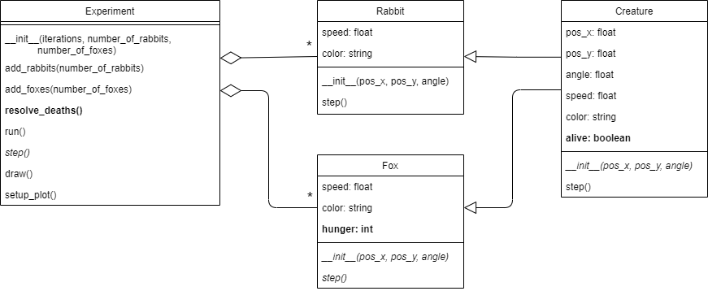

## Phase 6: Starving foxes

Before you continue, **make a copy of your previous file and call it `phase6.py`**. Make sure to **continue editing in this _new_ file**.

### Goal

We need to give the foxes a reason to eat the rabbits, so let's make them hungry. We will assume that hunger linearly increases over time, and that Foxes die when they are too hungry. Like so (notice the red dots disappearing):  

{: width="60%"}

In this simulation, the red dots disappear all at once. The reason behind this is that all Foxes are created at the same moment in time. This means that they get hungry at the same rate, and, since we have not implemented that part yet, they can not eat. So, all the foxes tragically die of hunger at the exact same time.

As you can see in the UML below, you will have to add some methods and attributes that take care of dead / alive creatures and foxes being hungry:

{: width="100%"}

As with previous UMLs, everything that you have to implement is made **bold** and everything that needs to be modified is made *italic*.

Note that we chose to make being alive or not to be a property of `Creature`, not just of `Fox`. This is a design choice we made because we know that in a future phase rabbits can also die, so we might as well make being alive or not a property of all creatures. Hunger, on the other hand, is modelled as a property of only foxes. For now, we will assume that rabbits do not need to eat.

### Specification

Modify the class `Creature`:

* *modify* method `__init__()`.
  * **add** attribute `alive`. This boolean registers if a creature is alive or not. Set the value of `alive` to `True`.

Modify the class `Fox`:

* *modify* method `__init__()`.
  * **add** attribute `hunger`. This is an integer indicating the degree of hunger of the fox (0 means no hunger at all). Set the value to `0`.
* *modify* method `step()` to increase hunger by 1 at every step. Set alive to `False` once hunger reaches 80 or more.

Modify the class `Experiment`:

* **add** method `resolve_deaths()` that checks all creatures. If a creature is not `alive` it should be removed from the list of creatures.

  **Hint:** Removing elements from a list *while you are looping over it* will usually result in bugs, so try to find a different way to solve this part of the assignment.

* *modify* method `step()` to call `resolve_deaths()`. _This should be done after **all** the creatures' `step()` methods have been called._ Deaths only have to be resolved once per iteration of the experiment.

### Test

See if it works. Are the foxes disappearing at iteration 80? (You can print the iteration number in the `run` method and print something every time a creature is removed to see if this corresponds.)
