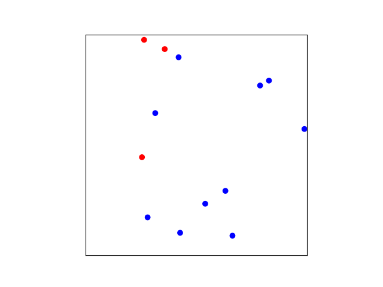
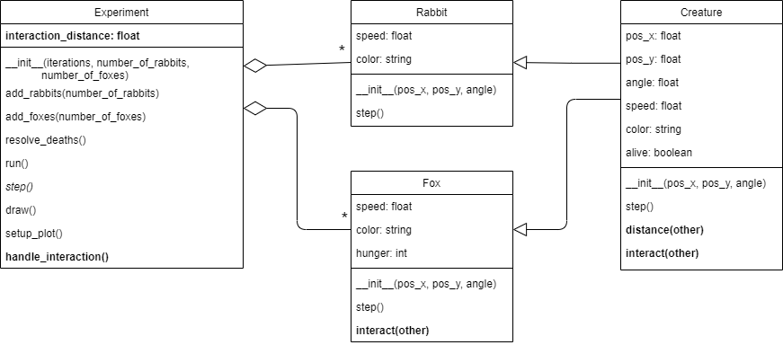

## Phase 7: Feeding foxes

Before you continue, **make a copy of your previous file and call it `phase7.py`**. Make sure to **continue editing in this _new_ file**.

### Goal

Now that the foxes can get hungry, they will have to be able to eat. The idea is that when a fox gets close enough to a rabbit, they can devour it. Upon being eaten, the rabbit will be removed from the experiment, and the fox will not be hungry anymore. In the example below you see that when a red dot comes close to a blue dot, the blue dot disappears. As a result, no longer disappear at iteration 80.

{: width="60%"}

To do this we need to be able to compute the *distance* between creatures and we need to have them *interact* when the distance is small enough. This requires modifications to all the classes. The UML below shows the elements that we need to add.

{: width="100%"}

We add the `distance()` method to the `Creature` class, as we need to be able to compute the distance between any type of creature, not only between foxes or rabbits. We add an `interact()` method to `Creature`, as potentially any creature can interact with any other creature. However, for now, this method should not do anything, as we only really implement the more specialized `interact()` method of the `Fox` class. In the `interact` method of the `Fox` class we define what happens when a fox interacts with another creature. If the other creature is a rabbit, the fox eats it.

This follows a design pattern that you see often in multi-agent systems: each of the creatures are responsible for their own interactions. That is to say that the `Experiment` code only decides whether or not two agents (i.e., `Creature`s) interact at all. The code for *how* they interact, so what an agent does when it encounters another, is part of the agent's class, not of the experiment. So the `Experiment` class checks whether two `Creatures` are close enough to interact (with the method `handle_interaction()`). When that is the case, the `Creature` itself defines how to interact. In this case, if one creature is a fox and the other creature a rabbit, the former should eat the latter (which is implemented by the `interact()` method in `Fox`).

As a consequence of this design, every `Creature` should have this `interact()` method, even if it doesn't do anything.

### Specification

Modify the class `Creature`:

* **add** method `distance(other)`. This should return the [Euclidean distance](https://en.wikipedia.org/wiki/Euclidean_distance) between this creature and an `other` creature.
* **add** method `interact(other)`. This method specifies what a creature should do when it interacts with another creature. For now, this method should not do anything, so you can leave the method empty with `pass`.

> The `pass` statement is used as a placeholder for future code. When the `pass` statement is executed, nothing happens, but you avoid getting an indentation error that would be caused by leaving the line directly under a function-/method-definition empty.

Modify the class `Experiment`:

* *modify* method `__init__()`.
  * **add** attribute `interaction_distance`. This sets a value for the maximal distance at which two creatures will interact. A good distance is `0.05`.
* **add** method `handle_interaction()`. This method tests the distance between **every pair** of creatures. If the distance is lower than `interaction_distance`, it calls the `interact` from one creature with the other creature as the argument.

    You can use the following code for that:

      def handle_interaction(self):
          for creature1 in self.creatures:
              for creature2 in self.creatures:
                  if creature1 is not creature2 and creature1.distance(creature2) < self.interaction_distance:
                      creature1.interact(creature2)

    Note that this code tests for every pair of creatures if they are close enough. If so, the method `interact()` is called on one creature with the other as an argument. The condition `not creature1 is creature2` in the if-statement prevents the interaction of a creature with itself.

    A consequence of this algorithm is that for every pair of creatures, the interact method is called twice. If creature A interacts with creature B then B also interacts with A. So if `interact()` is called on A with B as an argument, then interact will also be called on B with A as an argument. This is something to keep in mind for later phases.

    > The time complexity of this code is $$O(n^2)$$. That makes it the bottleneck of the simulation. If you want to simulate many creatures you would have to use fancier collision detection algorithms that have a lower time complexity, like [quadtrees](https://en.wikipedia.org/wiki/Quadtree). But don't do this now; it is difficult to implement!

* *modify* method `step()` to call `handle_interaction()`.

Modify the class `Fox`:

* **add** method `interact(other)`. This method specifies what a fox should do when it interacts with another creature: if the other creature is a rabbit, the fox is not hungry anymore (`hunger` is set back to `0`) and the rabbit is killed. The method should also call `super().interact(other)` to make sure that any functionality that is implemented in the future in `Creature`'s `interact()` is executed as well.

    Tip: you can use `if type(other) == Rabbit:` to test if the other creature is a rabbit. You can set the `alive` attribute of the rabbit to `False`, to kill the rabbit.

### Test

Do the rabbits seem to disappear when they encounter a fox?

Try some test cases:

* When you have 100 foxes and 100 rabbits, how quickly do the rabbits disappear?
* Make the `interaction_distance` 0. Do all the rabbits remain?
* Make the `interaction_distance` 1. Do all the rabbits disappear instantly?
* There are two possible outcomes: (1) The foxes eat all the rabbits and then slowly starve. Or (2) the foxes starve before all the rabbits are eaten and the rabbits survive. The outcome depends partly on the initial amount of rabbits. For example, given 20 initial rabbits, how many initial foxes do you minimally need to always wind up in situation 1? Experiment with this.
