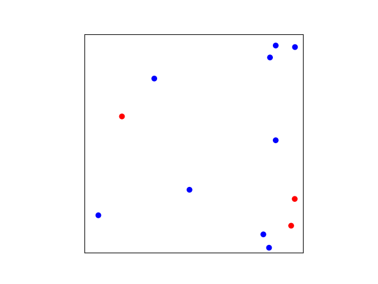
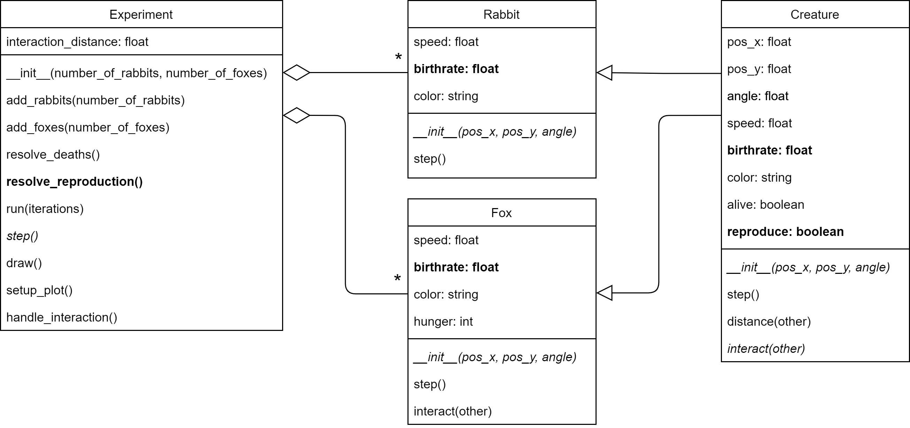

## Phase 8: Reproduction

Before you continue, **make a copy of your previous file and call it `phase8.py`**. Make sure to **continue editing in this new file**. It is important to keep the previous file as is. For this module, you'll have to submit all the stages separately.

### Goal

Now creatures can die because of hunger (foxes) or by being eaten (rabbits). But, we still need to make sure they can reproduce (i.e., e new creature of the same kind is introduced into the experiment). Every time a creature meats another creature of the same type, it will have a certain probability to reproduce. The probability of reproduction is given by the particular birth rate of the type of creature.

It is important to start with a low value for the birth rate. Reproduction is an exponential process and you can easily get an unmanageable explosion of creatures at a high birth rate. The experiment below runs with a $$0.15$$ birth rate for both foxes and rabbits.

{: width="60%"}

The UML below shows the required modifications.

{: width="100%"}

Every creature has a birth rate. The `Creature` class defines a default birth rate, but each type (`Fox` and `Rabbit`) also defines its own particular birth rate. There are also some modifications to handle the actual reproduction: The `Creature` class has a boolean `reproduce` to flag that it needs to be copied. And the `Experiment` class has a method `resolve_reproduction()` to manage the actual copying of instances when needed.

### Specification

Modify the class `Creature`:

* **add** attribute `birthrate`. This `float` indicates how likely it is that two creatures that interact will reproduce. This is the default birth rate for any creature. Value 0 means the creature will never reproduce; 1 means that the creature will reproduce at every interaction; and 0.5 means that a creature will reproduce at about half the interactions. The value is not super important as both `Fox` and `Rabbit` will define their specific birth rates.
* **add** attribute `reproduce`.
* *modify* the method `__init__()`. Set `reproduce` to `False`
* *modify* the method `interact()`. Every time two creatures of the same kind interact, with a probability of `birthrate`, set `reproduce` to `True`. Keep in mind that the interact method is called twice for each pair. So, an interaction may set `reproduce` to `True` for both creatures. You can solve this in many ways, but the easiest is to just leave it. If this leads to a reproduction rate that is too high, you can simply give the variable `birthrate` a lower value.

Modify the class `Fox`:

* **add** attribute `birthrate`. The initial birth rate of foxes is 0.15.
* *modify* method the `__init__()`. Set birth rate.

Modify the class `Rabbit`:

* **add** attribute `birthrate`. The initial birth rate of rabbits is 0.15.
* *modify* method the `__init__()`. Set birth rate.

Modify the class `Experiment`:

* **add** method `resolve_reproduction()`. This method checks all creatures. If a creature is marked for reproduction, add another creature of the same type to the experiment with a random location and angle. Make sure to unmark the creature for reproduction. Otherwise, it would start making endless copies.

    Note that it really needs to be a random new location. A creature cannot be spawned at a fixed location. Try to reason why this is.
* *modify* method `step()` to call `resolve_reproduction()`.

### Test

Experiment with different birth rates. See how they affect the possible outcomes of the experiment.
