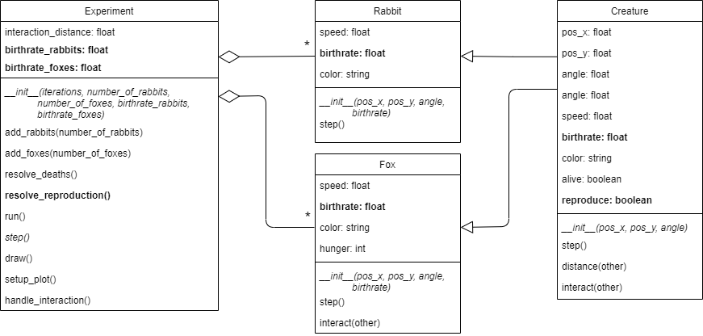

## Phase 8: Reproduction

Before you continue, **make a copy of your previous file and call it `phase8.py`**. Make sure to **continue editing in this new file**.

### Goal

Now creatures can die because of hunger (foxes) or by being eaten (rabbits). But, we still need to make sure they can reproduce (i.e., e new creature of the same kind is introduced into the experiment). Every time a creature meets another creature of the same type, it will have a certain probability to reproduce. The probability of reproduction is given by the particular birth rate of the type of creature.

It is important to start with a low value for the birth rate. Reproduction is an exponential process and you can easily get an unmanageable explosion of creatures at a high birth rate. The experiment below was configured with a birth rate of 0.15 for both rabbits and foxes.

{: width="60%"}

Ultimately, we would like to examine how the birthrates of foxes an rabbits affect the dynamics of the system as a whole. Therefore, it is important to make it easy to change the rate at which a specific species reproduce. Manually changing this value by going into the code, changing a parameter, and then running the code again is not a good solution. This would effectively make in impossible to run a large amount of automated experiments. We will resolve this by adding arguments to the initialization of the experiment class that can set the birthrate of rabbits and foxes to a specific desired value.

> There are multiple other parameters in our implementation that are not easily changeable, like `speed`, `color`, the amount of `hunger` a fox can have before it dies, and some others. Even though it would probably be better code design (increasing abstraction), we have chosen not to include these parameters in the initialization of the `Experiment` class. _If you are up to the challenge, you are allowed improve the implementation of these features, as long as the code functions in the same way._

The UML below shows the required modifications.

{: width="100%"}

By default, every creature has a `birthrate`. This attribute is defined in the `Creature` class and set during initialization of the `Creature`.

There are also some modifications that are required to handle the actual reproduction. For example, the `Creature` class has a boolean attribute named `reproduce` to flag that a new creature of the same type needs to be created. The `Experiment` class has a new method `resolve_reproduction()` to detect these flags and create new creatures when needed. The methods `add_rabbits()` and `add_foxes()` can be reused to add these creatures to the system.

One of our goals was to make it possible to set the values for the `birthrate` of all foxes and/or rabbits to a specific value when initializing the `Experiment`. This means that the birthrates for foxes and rabbits need to become attributes of the `Experiment` class, as they are needed every time we use `add_rabbits()` or `add_foxes()`.

> You might have noticed the code duplication in the methods `add_rabbits()` and `add_foxes()`. Alternative ways of implementing the experiment parameters or the aforementioned methods would make the code more complex, and therefore more difficult to implement. We have opted for the easier implementation. _If you are up to the challenge, you are allowed improve the implementation of these features, as long as the code functions in the same way._

### Specification

Modify the class `Creature`:

* *modify* the method `__init__()`.
  * **add** attribute `birthrate`. This `float` indicates how likely it is that two creatures that interact will reproduce. This is the default birth rate for any creature. Value 0 means the creature will never reproduce; 1 means that the creature will reproduce at every interaction; and 0.5 means that a creature will reproduce at about half the interactions. Set this value to 0 by default.
  * **add** attribute `reproduce`. Set `reproduce` to `False`.
* *modify* the method `interact()`. Every time two creatures of the same kind interact, with a probability of `birthrate`, set `reproduce` to `True`. Recall that the interact method is called twice for each pair. So, an interaction may set `reproduce` to `True` for both creatures. You can solve this in many ways, but the easiest is to just leave it. If this leads to a reproduction rate that is too high, we can simply set the `birthrate` of the creatures to a lower value.

Modify the class `Fox`:

* *modify* `__init__()` to accept the new parameter `birthrate` and use it to set the value for the attribute `birthrate`.

Modify the class `Rabbit`:

* *modify* `__init__()` to accept the new parameter `birthrate` and use it to set the value for the attribute `birthrate`.

Modify the class `Experiment`:

* *modify* `__init__()`
  * *modify* the header of the method to accept the new parameters `birthrate_rabbits` and `birthrate_foxes`
  * **add** the attributes `birthrate_rabbits` and `birthrate_foxes`
* *modify* the methods `add_rabbits()` and `add_foxes()`. Since we have added `birthrate` to the `__init__` of our creatures, adjust the code that creates `Rabbit` and `Fox` instances such that it uses the `birthrate_rabbits` or `birthrate_foxes` from the `Experiment` instead.
* **add** the method `resolve_reproduction()`. This method checks all creatures. If a creature is marked for reproduction, add another creature of the same type to the experiment with a random location and angle. Make sure to unmark the reproducing creature for reproduction. Otherwise, the creature would start making endless copies.

    Note that it really needs to be a random new location. A creature cannot be spawned at a fixed location or the location of the parent! Try to reason why this is the case.
* *modify* method `step()` to call `resolve_reproduction()`.

### Test

Experiment with different birth rates. See how they affect the possible outcomes of the experiment.

Note that high birthrates can cause your simulation to slow down significantly. What is the cause of this?
