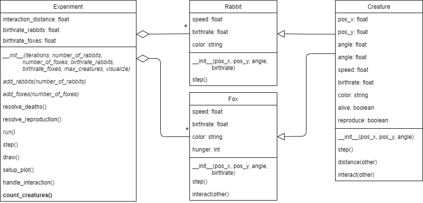

## Phase 9: Controlling Growth

Before you continue, **make a copy of your previous file and call it `phase9.py`**. Make sure to **continue editing in this new file**.

### Goal

We would like to be able to use our model to run a whole suite of experiments using several experiment parameters. These experiments will provide data that can be used to explore the dynamics and interactions of the different creatures within the simulation. In this phase we will work on making the experimentation possible, by addressing a couple of issues:

1. The model has potential for exponential population growth. In our model, reproduction is an exponential process. If more rabbits are born than the foxes can eat, the number rabbits will quickly increase and your program will become unresponsive. The easiest way to deal with that, for now, is by putting a cap on the total number of creatures.

2. After running an experiment, we are interested in the number of rabbits and foxes remaining. We need to write a function that can be used to determine the number of `Rabbit` and `Fox` instances that are currently present in the `Experiment`'s `creatures` list. We will use this to evaluate the final results of our experiments.

3. When we are doing a lot of experiments with different parameters, it is probably not necessary to view the visualization every single time. Visualizing the simulation is relatively slow, and ultimately we are only interested in the result of the simulation. For this reason, our last addition to the `Experiment` class is a boolean attribute `visualize`. When it is set to `True` we display our visualization, but by default we will set this value to `False`.

The UML below shows the required modifications:

{: width="100%"}

### Specification

Modify the class `Experiment`:

* *modify* `__init__()` to accept two new parameters: `max_creatures`, and `visualize`
  * All parameters should be stored as attributes.
  * `max_creatures` should get a default *argument* value of `50` in the method header
  * `visualize` should get a default *argument* value of `False` in the method header
* *modify* `__init__()` such that the call to the method `setup_plot()` is only done when `visualize` is set to `True`
* *modify* the method `run()`. It should only call the method `draw()` when `visualize` is set to `True`
* *modify* the methods `add_rabbits()` and `add_foxes()`. They should only add creatures as long as there are fewer creatures in the list `creatures` than `max_creatures`.
* **add** the method `count_creatures()`. The method should return two values as a tuple; the first being the number of `Rabbit` instances in `self.creatures`, the second the number of `Fox` instances.

### Test

Run some tests to determine whether the newly added features function as intended.

* Is the visualization disabled by default?
* Can you enable the visualization by setting the argument `visualize` to `True` when creating an `Experiment`?
* After running an experiment, can you use the `count_creatures()` method to determine the number of rabbits and foxes remaining? Do these numbers seem correct?
* When you set a high birthrate for rabbits or foxes, do their numbers not grow beyond the value you set for `max_creatures`?
