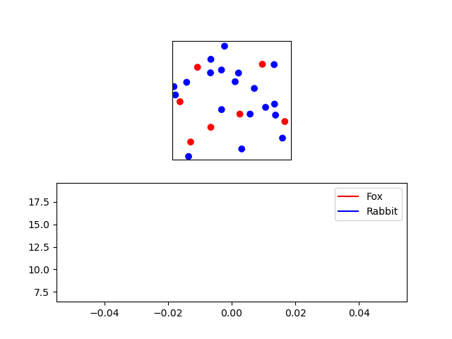
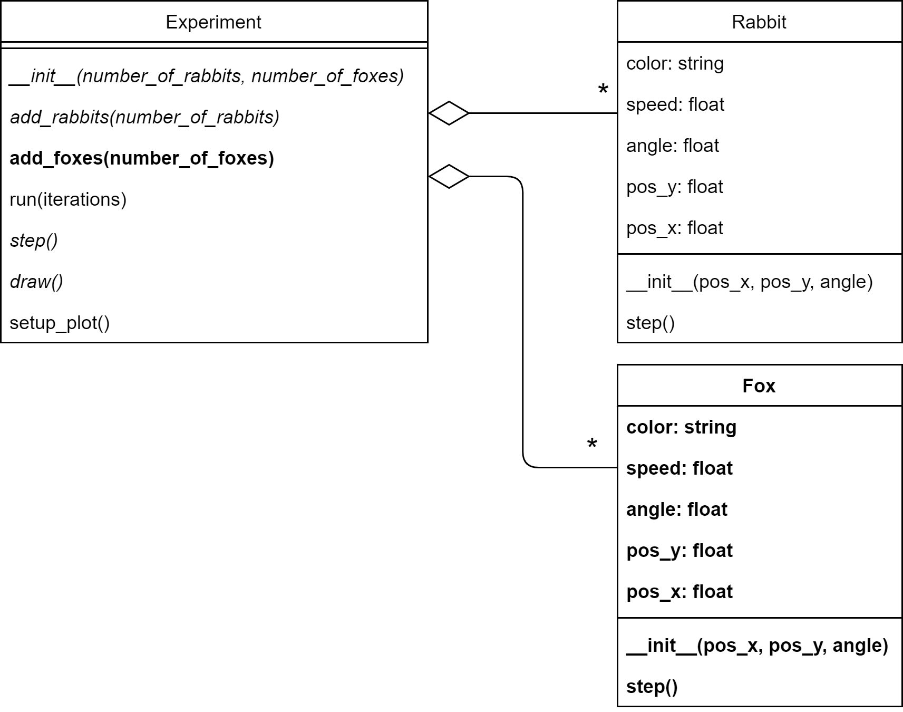
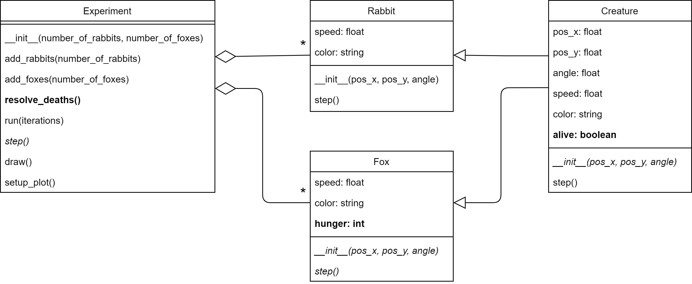

# Page 1: OO-video

# Page 2: Cards

After that, do the following small assignment: [cards](https://lab.cs50.io/minprog/objects/master/cards/lab)

# Page 3-...: Population

We want to know how a population of foxes and rabbits interact with each other. Specifically: *How does the birth rate of rabbits influence the population*.

## Background

A famous mathematical description of the interactions in the predator-prey model are the [Lotka-Volterra equations](https://en.wikipedia.org/wiki/Lotka–Volterra_equations). It is not important to know or understand these equations for this assignment. But if you're curious, here they are:

$$\begin{align*}
\frac{dx}{dt} &= \alpha x - \beta x y \\
\frac{dy}{dt} &= \delta x y - \gamma y
\end{align*}
$$

Where $x$ is the number of prey, $y$ is the number of predators, $t$ is time, and the other variables describe the interactions between species. Since this is a mathematical model and not the real world, the population of a species is allowed to be a floating point number.

We're not doing mathematics, but computer programming. So what we will do is simulate the behavior of predators (foxes) and prey (rabbits). Of course, we will have to make a lot of simplifying assumptions to do so. In this assignment, you will iteratively build up the system. We'll start with something simple (a moving dot) and build it out to something more complex and interesting. The resulting model can be considered a [complex system](https://en.wikipedia.org/wiki/Complex_system#:~:text=Complex%20systems%20are%20systems%20whose,given%20system%20and%20its%20environment.). As such, you can rely on analyses that are common in that field such as [sensitivity analysis](https://en.wikipedia.org/wiki/Sensitivity_analysis).

## General goal

The simulation below shows the interaction between rabbits (blue) and foxes (red). They can both reproduce if they meet a creature of the same species. And the foxes can grow hungry, if they eat a rabbit, they can continue for longer. If they can't find a rabbit to eat they will eventually die.

{: width="80%"}

As you see the foxes in this simulation use up all their resources (rabbits), which leads to the collapse of their ecosystem and eventually their demise. You're going to find out if this can be prevented.

The simulation has a lot of moving (harr) parts. And is too complex to build in one go. In such cases, it is good practice to start with something simple and gradually build it out to the desired result.

For the first part of this module, we will specify exactly how to make an increasingly complex class structure in 9 phases. This might feel a bit restrictive, but it is a good way to learn how you can build complex object-oriented projects.

## Overview

The experiment is essentially a [multi-agent system](https://en.wikipedia.org/wiki/Multi-agent_system). A multi-agent system consists of agents that can move around and interact. Any multi-agent system will have to implement several features:

* There should be a world for the agents (the rabbits and foxes) to exist in. In our case, this is simply a space of dimensions 1 by 1. The dimensions don't have a particular meaning, but you can imagine them as kilometers.
* The agents have to be able to move around.
* The agents have specific personal behavior. For example, the foxes will get hungry.
* The agents can interact: Foxes can eat rabbits and all creatures can reproduce.

In phase 1 of the experiment, you'll set up the world and create a rabbit agent. Phases 1 - 5 are about creating the agents and having them move around. In phase 6 you'll implement the fox's specific behavior (hunger). Up to this point, there is no interaction between agents. This interaction you'll implement in phases 7 - 9.

## Phase 1: Rabbit
Start by downloading the file [phase1.py](phase1.py). This will be the starting point for this assignment.

### Goal
Let's start by having a single rabbit move over the screen. Like in the example below.

{: width="60%"}

The blue dot represents a rabbit and it follows a straight path at a certain angle. When it hits the border it turns 180 degrees around.

### Provided code

The file `phase1.py` you downloaded contains an `Experiment` class. This class contains the main functionality for plotting and managing the experiment you're about to make. In this assignment, you will iteratively extend the functionality of this class and add other classes.

The main code (below the `Experiment` class) creates a new rabbit with a specific position in the field ($$0.25$$, $$0.75$$) and a specific angle of movement ($$\pi/4$$). Then, a new experiment is created containing this rabbit. And, in the last step, the experiment is run for $$100$$ iterations. All done by these three lines:

    my_rabbit = Rabbit(0.25, 0.75, math.pi/4)
    my_experiment = Experiment(my_rabbit)
    my_experiment.run(100)

This would show the moving blue dot (the rabbit), were it not that you still have to implement the `Rabbit` class. The relation between the `Experiment` and `Rabbit` class is displayed in the following [UML](https://en.wikipedia.org/wiki/Unified_Modeling_Language) diagram:

{: width="70%"}

In this diagram, you see that an object of the class `Experiment` contains exactly one object of the class `Rabbit`. This is shown by the line that starts with the diamond shape (⬦---) and has the `1` written next to the `Rabbit` class. The diamond shape denotes aggregation (i.e., "contains") and the number denotes how many. So this translates to: "an experiment contains one rabbit".

The UML diagram also shows the methods and attributes that the classes have.

For convenience, we've made everything that you still have to implement bold.

### Specification
So what you get is most of the class `Experiment`. This class contains the following:

* The method `__init__(rabbit)`. This is called when you create a new experiment. So when you create a new experiment you have to give it a rabbit object as an argument.
* The method `step()`. This will call the `step()` method of the rabbit, having it update its location based on its speed and angle.
* The method `run(iterations)`. This will run the simulation/experiment by calling `step()` and `draw()` successively an `iteration` number of times.
* The method `setup_plot()`. This is called by `__init__()` and configures matplotlib for this experiment.

For the class `Experiment` you still have to:

* *modify* the method `draw()`. This will draw the blue dot at the location of the rabbit. This is not finished yet. You'll have to add the code to actually draw the rabbit. (Tip: you can use the matplotlib method `self.ax1.scatter(...)` for this.)

You also have to implement the class `Rabbit`:

* **add** class `Rabbit`
* **add** attribute `pos_x`, `pos_y`: The position of the rabbit. These are values between $$0$$ and $$1$$, where $$0, 0$$ is the left-bottom corner of the field and $$1, 1$$ is the right-upper corner.
* **add** attribute `angle`: The angle at which the rabbit will move. An angle of $$0$$ makes the rabbit move along the x-axis and an angle of $$\pi /2$$ makes the rabbit move along the y-axis.
* **add** attribute `speed`: The speed at which the rabbit moves every step of the simulation ($$0.01$$ is a good value to start with).
* **add** attribute `color`: The color for displaying the rabbit in the plot. Rabbits get the color `'blue'`.
* **add** method `__init__(pos_x, pos_y, angle)`: This method is automatically called when creating a new `Rabbit` object. When creating a new `Rabbit` object, you have to provide the position and angle. The method should assign those to the appropriate attributes. The init should also set the values for `speed` and `color`.
* **add** method `step()`: Run a single step of the simulation. This should update the position of the rabbit.
    The rate of change ($$dx$$ and $$dy$$) is given by the formulas:

    $$\begin{align*}
    dx &= \textrm{cos}(\textrm{angle}) \cdot \textrm{speed} \\
    dy &= \textrm{sin}(\textrm{angle}) \cdot \textrm{speed}
    \end{align*}
    $$

    We can use these values to update the $$x$$ and $$y$$ positions:

    $$\begin{align*}
    \textrm{pos _ x} &= \textrm{pos_ x} + dx \\
    \textrm{pos_ y} &= \textrm{pos_ y} + dy
    \end{align*}
    $$

    There is a very important (literal) edge case: When the rabbit reaches the edge of the field (its x or y location is smaller than 0 or bigger than 1), it should not change its position but turn around (i.e., increase the angle by $$\pi$$).

> Note: None of the methods mentioned above and shown in the UML contain the `self` parameter, this is left out (as is conventional in UML diagrams) but you always have to add this parameter in your code. So when you create the method `__init__(pos_x, pos_y, angle)`, it should be defined as `def __init__(self, pos_x, pos_y, angle):`. The same goes for the method `step()`: `def step(self):`.

> Tip: The number of iterations of the experiment is set to 100 in the example code. It might save you a lot of time to set this to some very small number (like 5) in the beginning, and only when that seems to work set it back to 100. That way you don't have to wait so much every time you're trying to run your code.

### Test

Test what you've done so far. Is the rabbit moving?

Here are some test cases you can use:

* Set the angle to $$0$$. Does the rabbit follow the x-axis?
* Set the angle to $$\pi$$ (`math.pi`). Does it go in the opposite direction?
* Set the angle to $$1/2 \pi$$. Does the rabbit follow the y-axis?
* Increase the speed to $$0.02$$. Does the rabbit seem to move twice as fast?
* Set the speed of the rabbit to $$0$$. Does it stay still?

## Phase 2: Rabbits

Before you continue, **make a copy of your previous file and call it `phase2.py`**. Make sure to **continue editing this new file**. It is important to keep the previous file as is. For this module, you'll have to submit all the stages separately.

### Goal

A single rabbit moving around is a bit boring, let's add some more. Like so:

{: width="60%"}

The great thing about using classes is that we can make multiple instances of a specific class. So we can add multiple rabbits without modifying the `Rabbit` class and with only small modifications to the `Experiment` class.

After your changes the UML should look like this:

{: width="70%"}

The fact that `Experiment` can contain any number of rabbits is indicated by the `*` near the `Rabbit` class on the aggregation line. In the UML everything that is bold is new (and is up to you to implement). So here you'll have to add the method `add_rabbits(number_of_rabbits)`. Everything in italic is not new, but you will have to modify it to make things work.

### Specification

For this phase you have to *modify* the class `Experiment` as follows:

* *modify* attribute `rabbit` (of type `Rabbit`) to `rabbits` (of type `List`).
* **add** method `add_rabbits(number_of_rabbits)` that creates a list of rabbits with random locations and angles and adds them to the attribute `rabbits`.
* *modify* `__init__(number_of_rabbits)` to accept the new parameter `number_of_rabbits` and use `add_rabbits()`.

    **From here on the `Rabbit` objects will be created *inside* the `Experiment` object.** We don't have to do this in the main code anymore as we did in Phase 1.

* *modify* method `step()` to call the `step()` method of *all* rabbits.
* *modify* method `draw()` to draw *all* rabbits. *Tip: don't use a loop for calling `self.ax1.scatter(...)` many times as this will make your code very slow. Try to collect all the coordinates to plot first and call `self.ax1.scatter(...)` only once to plot all the sheep in one go.*

The experiment should spawn 10 rabbits when called like this:

    my_experiment = Experiment(10)
    my_experiment.run(100)

> Don't forget the `self` parameter when you define new methods.

### Test

Make sure your experiment works with 1 rabbit:

    my_experiment = Experiment(1)
    my_experiment.run(100)

Make sure your experiment works with 100 rabbits:

    my_experiment = Experiment(100)
    my_experiment.run(100)

And, with 0 rabbits:

    my_experiment = Experiment(0)
    my_experiment.run(100)

## Phase 3: More natural movement

Before you continue, **make a copy of your previous file and call it `phase3.py`**. Make sure to **continue editing in this new file**. It is important to keep the previous file as is. For this module, you'll have to submit all the stages separately.

### Goal

The straight lines that the rabbits walk don't feel particularly natural. Let's add some unpredictability to their movements. Let's have them change directions from time to time. Like this:

{: width="60%"}

The resulting UML will be the same as in the previous step. You don't need to add any classes or methods. You'll just have to modify `step()` slightly.

{: width="70%"}

### Specification

*Modifications* to the class `Rabbit`:

* *modify* method `step()` to get the rabbit to change `angle` regularly. The rabbit has a $$20\%$$ probability to *update* its angle with a random value between $$-\pi/2$$ and $$\pi/2$$ (i.e., between $$-90$$ and $$+90$$ degrees). So this is the change of angle relative to the current `angle`. The possible update of the `angle` should be done *before* taking a step.

### Test

Here are some useful test cases.

* Do the rabbits seem to move around more naturally (similar to the example animation above)?
* Set the probability to update to $$0\%$$ (so the angle should never change). Are the rabbits moving in a straight line?
* Set the probability to update back to $$20\%$$ but alter the random angle change values to be between $$0$$ and $$0$$ (so the angle shouldn't change). Are the rabbits moving in a straight line? (If they are all moving exactly along the x-axis, something is wrong.)

## Phase 4: Foxes

Before you continue, **make a copy of your previous file and call it `phase4.py`**. Make sure to **continue editing in this new file**. It is important to keep the previous file as is. For this module, you'll have to submit all the stages separately.

### Goal

Let's add the foxes to the experiment. For now, they're just going to walk around and not bother any rabbits. Foxes are in many ways similar to rabbits, they have a position and an angle and they move around. But their movements are slightly different. They go faster and they make slower turns. We will give foxes the color red. The new simulation will look like this:

{: width="60%"}

This will require a whole new class `Fox` as you can see in the UML:

{: width="70%"}

You see that the class `Experiment` can contain any number of instances of `Fox` (as indicated by the `*`).

### Specification

For the class `Fox`:

* **add** class `Fox`. For now, it has the same properties as the `Rabbit`, only the speed and color have different values.
* **add** attributes `pos_x`, `pos_y`.
* **add** attribute `angle`.
* **add** attribute `speed`. The speed of the fox should be $$0.03$$ (faster than the rabbit).
* **add** attribute `color`. Foxes get the color `'red'`.
* **add** method `__init__(pos_x, pos_y, angle)`.
* **add** method `step()`. The steps are the same as for `Rabbit` only the change of angle is less abrupt: the angle has a $$20\%$$ probability of changing by a random value between $$-\pi/4$$ and $$\pi/4$$ (i.e., between -45 and 45 degrees).

For the class `Experiment`:

* *change* attribute `rabbits` to `creatures`. This list will now contain both foxes and rabbits.
* **add** `add_foxes(number_of_foxes)` this should add foxes to the list of creatures.
* *modify* `__init__(number_of_rabbits, number_of_foxes)`. The method should now get an additional parameter for the number of foxes. And it should call the method `add_foxes()`.
* *modify* `add_rabbits(number_of_rabbits)` to add the Rabbit instances to the list `creatures` instead of to `rabbits`.
* *modify* `step()` to use the list `creatures` in stead of `rabbits`.
* *modify* `draw()` to use the list `creatures` in stead of `rabbits`.

The experiment should spawn 10 rabbits and 3 foxes when called like this:

    my_experiment = Experiment(10,3)
    my_experiment.run(100)

### Test

Do the foxes seem to move faster than the rabbits?

Think about how you can test if everything works as expected. Test at least a few different configurations.

For example, an experiment without foxes:

    my_experiment = Experiment(10,0)
    my_experiment.run(100)

an experiment without rabbits:

    my_experiment = Experiment(0,3)
    my_experiment.run(100)

an experiment without any creature:

    my_experiment = Experiment(0,0)
    my_experiment.run(100)

Change the parameters of the fox and see if you have the expected behavior. What happens when you make the angle of change of the foxes 0? What happens when you set their speed to 0? Is this what you would expect?

## Phase 5: Creatures

Before you continue, **make a copy of your previous file and call it `phase5.py`**. Make sure to **continue editing in this new file**. It is important to keep the previous file as is. For this module, you'll have to submit all the stages separately.

### Goal
Before adding more complexity again in the next phase, let's now focus on making the code a bit nicer.

As you might have realized by now, for the previous phase you created a lot of duplicate code. The class `Fox` and `Rabbit` have a lot of overlap. Not that surprising, since a big part of the code for both classes has to do with them being creatures that walk around in this simulated world.

So let's create a new abstraction: You're going to create a superclass called `Creature`. This class will contain the code for moving around that both `Fox` and `Rabbit` will inherit.

The UML will look like this:

{: width="100%"}

Notice that class inheritance is indicated by arrows (⇽). So `Fox` and `Rabbit` both inherit from `Creature`. You can also see that `Fox` and `Rabbit` are reduced a lot as most of their code will now reside in `Creature`.

### Specification

Create a new class called `Creature`. For this class:

* **add** attributes `pos_x`, `pos_y`.
* **add** attribute `angle`.
* **add** attribute `speed`. Creatures get the default speed $$0.01$$.
* **add** attribute `color`. Creatures get the default color `'black'`.
* **add** method `__init__(pos_x, pos_y, angle)`.
* **add** method `step()`. This method should only define the step based on the current angle, position and speed. It should not define the change of angle as that part is defined in the `step()` methods of the subclasses `Rabbit` and `Fox`

Modify the `Fox` class. You can remove a lot of code and inherit it from `Creature`.

* *modify* class `Fox`. The class definition should now be changed to inherit from `Creature`.
* *modify* method `__init__(pos_x, pos_y, angle)` to call the `__init__()` method from the superclass (using `super()`). After this, you should still specify `speed` and `color` in this class as those properties are particular to `Fox`.
* *modify* method `step()` to call the same method from the superclass. Only the modification of the angle should remain in this class (as the logic for changing angles is particular to the `Fox` class).

Modify class `Rabbit` in the same way as `Fox`.

### Test

This was only a design change. If you did it correctly, it shouldn't have changed any of the behavior of the experiment. Test this by using some of the test cases from the previous phases. Pay special attention if the movement behavior of the fox is still independent of that of the rabbit. Can you, for example, change the speed of the foxes without changing the speed of the rabbits?

## Phase 6: Starving foxes

Before you continue, **make a copy of your previous file and call it `phase6.py`**. Make sure to **continue editing in this new file**. It is important to keep the previous file as is. For this module, you'll have to submit all the stages separately.

### Goal

We need to give the foxes a reason to eat the rabbits, so let's make them hungry. We'll assume that hunger just linearly increases over time and that when Foxes are too hungry they die. Like so (notice the red dots disappearing):  

{: width="60%"}

The red dots disappear all at once because the foxes all come into existence at the same time, they get hungry at the same rate, and they cannot feed yet (we have not implemented that part yet), so the foxes all tragically die of hunger at the exact same time.

As you can see in the UML below, you will have to add some methods and attributes that have to do with managing creatures being alive or not and foxes being hungry:

{: width="100%"}

Note that we chose to make being alive or not to be a property of `Creature`, not just of `Fox`. This is because we know that in a future phase rabbits can also die, so we might as well make being alive or not a property of all creatures. Hunger, on the other hand, is modelled as a property of only foxes as, at least for now, we will assume that rabbits don't need to eat.

### Specification

Modify the class `Creature`:

* **add** attribute `alive`. This boolean registers if a creature is alive or not.
* *modify* method `__init__()` to set alive to its default value: `True`.

Modify the class `Fox`:

* **add** attribute `hunger`. This is an integer indicating the degree of hunger of the fox (0 means no hunger at all).
* *modify* method `__init__()` to set hunger to 0.
* *modify* method `step()` to increase hunger by 1 at every step. Set alive to `False` once hunger is bigger than 80.

Modify the class `Experiment`:

* **add** method `resolve_deaths()` that checks all creatures. If a creature is not `alive` it should be removed from the list of creatures.
* *modify* method `step()` to call `resolve_deaths()` at the end of every step.

### Test

See if it works. Are the foxes disappearing at iteration 80? (You can print the iteration number or show it in the plot to see if this corresponds.)

## Phase 7: Feeding foxes

Before you continue, **make a copy of your previous file and call it `phase7.py`**. Make sure to **continue editing in this new file**. It is important to keep the previous file as is. For this module, you'll have to submit all the stages separately.

### Goal

Now that the foxes can get hungry they'll have to be able to feed. The idea is that when a fox gets close enough to a rabbit he can eat it. The rabbit will then be removed from the experiment and the fox will not be hungry anymore. In the example below you see that when a red dot comes close to a blue dot, the blue dot disappears. As a result, the red dots stay longer in the experiment.

{: width="60%"}

The UML below shows the elements that we need to add. We need to be able to compute the *distance* between creatures and we need to have them *interact* when the distance is small enough. This requires modifications to all the classes. We add the `distance()` method to the `Creature` class as we need to be able to compute the distance between any type of creature, not only between foxes or rabbits. We add an `interact()` method to `Creature` as potentially any creature can interact with any other creature. However, for now, this remains empty. As we only really implement the more specialized `interact()` method of the `Fox` class. Here we define what happens when a fox interacts with another creature. (If the other creature is a rabbit, the fox eats it.)

{: width="100%"}

This design follows a design pattern that you see more often in multi-agent systems: the creatures are responsible for their own interactions. That is to say that the `Experiment` code only decides whether or not two agents (i.e., `Creature`s) interact at all. The code for *how* they interact, so what an agent does when it encounters another is part of the agent's class, not of the experiment. So the `Experiment` class checks if two `Creatures` are close enough (with the method `handle_interaction()`). When that is the case, the `Creature` defines how to interact, so in this case, if the one creature is a fox and the other creature a rabbit, the first should eat the latter (which is implemented by the `interact()` method in `Fox`).

As a consequence of this design, every `Creature` should have this `interact()` method, even if it doesn't do anything.

### Specification

Modify the class `Creature`:

* **add** method `distance(other)`. This should return the distance between the creature and another one.
* **add** method `interact(other)`. This method specifies what a creature should do when it is close enough to another creature. For now, nothing, so you can leave the method empty with `pass`.

Modify the class `Fox`:

* **add** method `interact(other)`. This method specifies what a fox should do when it is close enough to another creature: If the other creature is a rabbit, the fox is not hungry anymore (so `hunger` is set back to `0`) and the rabbit is killed. (You can use the `alive` flag of the rabbit to `False`, to kill the rabbit.)

    Tip: you can use `if type(other) == Rabbit:` to test if the other creature is a rabbit.

Modify the class `Experiment`:

* **add** attribute `interaction_distance`. This sets at which minimal distance two creatures can interact. A good distance is `0.05`.
* **add** method `handle_interaction()`. This method tests the distance between **every pair** of creatures. If the distance is lower than `interaction_distance`, it calls the `interact` from one creature with the other creature as the argument.

    You can use the following code for that:

        def handle_interaction(self):
            for creature1 in self.creatures:
                for creature2 in self.creatures:
                    if not creature1 is creature2 and creature1.distance(creature2) < self.interaction_distance:
                        creature1.interact(creature2)

    Note that this code tests for every pair of creatures if they are close enough. If so, the method `interact()` is called on one creature with the other as an argument. The condition `not creature1 is creature2` in the if-statement prevents the interaction of a creature with itself.

    The time complexity of this code is $$O(n^2)$$. That makes it the bottleneck of the simulation. If you want to simulate many creatures you would have to use fancier collision detection algorithms that have a lower time complexity, like [quadtrees](https://en.wikipedia.org/wiki/Quadtree). But don't do this now.

    A consequence of this algorithm is that for every pair of creatures, the interact method is called twice. If creature A interacts with creature B then the reverse is also the case. So if `interact()` is called on A with B as an argument, then interact will also be called on B with A as an argument. This is something to keep in consideration for later phases.

* *modify* method `step()` to call `handle_interaction()`.

### Test

Do the rabbits seem to disappear when they encounter a fox?

Try some test cases:
* When you have 100 foxes and 100 rabbits, how quickly do the sheep disappear?
* Make the `interaction_distance` 0. Do all the rabbits remain?
* Make the `interaction_distance` 1. Do all the rabbits disappear instantly?
* There are two possible outcomes: (1) The foxes eat all the rabbits and then slowly starve. Or (2) the foxes die out before all the rabbits are eaten and the rabbits survive. The outcome depends partly on the initial amount of rabbits. Experiment with this: For example, given 20 initial rabbits, how many initial foxes do you minimally need to always wind up in situation 1?

## Phase 8: Reproduction

Before you continue, **make a copy of your previous file and call it `phase8.py`**. Make sure to **continue editing in this new file**. It is important to keep the previous file as is. For this module, you'll have to submit all the stages separately.

### Goal

Now creatures can die because of hunger (foxes) or by being eaten (rabbits). But, we still need to make sure they can reproduce (i.e., e new creature of the same kind is introduced into the experiment). Every time a creature meats another creature of the same type, it will have a certain probability to reproduce. The probability of reproduction is given by the particular birth rate of the type of creature.

It is important to start with a low value for the birth rate. Reproduction is an exponential process and you can easily get an unmanageable explosion of creatures at a high birth rate. The experiment below runs with a $$0.15$$ birth rate for both foxes and rabbits.

{: width="60%"}

The UML below shows the required modifications.

{: width="100%"}

Every creature has a birth rate. The `Creature` class defines a default birth rate, but each type (`Fox` and `Rabbit`) also defines its own particular birth rate. There are also some modifications to handle the actual reproduction: The `Creature` class has a boolean `reproduce` to flag that it needs to be copied. And the `Experiment` class has a method `resolve_reproduction()` to manage the actual copying of instances when needed.

### Specification

Modify the class `Creature`:

* **add** attribute `birthrate`. This `float` indicates how likely it is that two creatures that interact will reproduce. This is the default birth rate for any creature. Value 0 means the creature will never reproduce; 1 means that the creature will reproduce at every interaction; and 0.5 means that a creature will reproduce at about half the interactions. The value is not super important as both `Fox` and `Rabbit` will define their specific birth rates.
* **add** attribute `reproduce`.
* *modify* the method `__init__()`. Set `reproduce` to `False`
* *modify* the method `interact()`. Every time two creatures of the same kind interact, with a probability of `birthrate`, set `reproduce` to `True`. Keep in mind that the interact method is called twice for each pair. So, an interaction may set `reproduce` to `True` for both creatures. You can solve this in many ways, but the easiest is to just leave it. If this leads to a reproduction rate that is too high, you can simply give the variable `birthrate` a lower value.

Modify the class `Fox`:

* **add** attribute `birthrate`. The initial birth rate of foxes is 0.15.
* *modify* method the `__init__()`. Set birth rate.

Modify the class `Rabbit`:

* **add** attribute `birthrate`. The initial birth rate of rabbits is 0.15.
* *modify* method the `__init__()`. Set birth rate.

Modify the class `Experiment`:

* **add** method `resolve_reproduction()`. This method checks all creatures. If a creature is marked for reproduction, add another creature of the same type to the experiment with a random location and angle. Make sure to unmark the creature for reproduction. Otherwise, it would start making endless copies.

    Note that it really needs to be a random new location. A creature cannot be spawned at a fixed location. Try to reason why this is.
* *modify* method `step()` to call `resolve_reproduction()`.

### Test

Experiment with different birth rates. See how they affect the possible outcomes of the experiment.

## Experiment 1: Stable population

Make a copy of your previous file and call it `experiment1.py`. Make sure to continue editing in this new file. It is important to keep the previous file as is. For this module, you'll have to submit all the stages separately.

### Goal

Let's do a first real experiment. You're going to track the size of both the populations over time (iterations), like in the example below:

{: width="80%"}

As you can see here, the population of rabbits is not stable. The rabbits die out at around iteration 100. Your goal is to set the birth rate of foxes to 0.05 and find a birth rate of rabbits that makes the population relatively stable (there are always between 10 and 50 rabbits in the system for at least 200 iterations).

### Setup

You will still need to modify the classes to be able to run this experiment, but we're not going to spell out how to do it. It's up to your design now.

One of the things to account for is the potential for exponential population growth. Since reproduction is an exponential process, if there are too many rabbits for the foxes to keep up with, they will overrun the system and their numbers will explode. The easiest way to deal with that, for now, is by putting a cap on the total number of rabbits. So we don't ever allow more than 100 rabbits to exist at the same time. (Putting a cap on the foxes is less important as they will only be able to grow in numbers when there are enough rabbits to eat. So capping rabbits automatically caps the number of foxes.)

We also want to have a timeline plot that monitors the number of rabbits and foxes in the system. Like in the example above.

### Specification

So to run the experiment you have to change the following:

* Add a way to set a maximum amount of rabbits. Make sure that, once that number is reached, the reproduction of rabbits is temporarily blocked.
* Create a second subplot that shows a timeline of the rabbits and foxes. You can create a second subplot like so:

        self.fig, (self.ax1, self.ax2) = plt.subplots(2)

    You can then plot using the `ax2` like this:

        self.ax2.plot(iterations_list, fox_history, color='red')

    Where for `iterations_list` and `fox_history` you have to fill in your own data.

    Don't forget to clear the plot in the same way you clear the plot of `ax1`:

        self.ax2.cla()

    These two changes might require some refactoring of your code and/or additional methods and attributes. It's up to you to decide how to implement this. But you might, at least, want to have an additional method that allows you to count creatures of a specific type in the experiment.
* Draw a new UML diagram of your update and save this as `experiment1-uml.png`. You can hand draw it and take a photo if you want.
    * Make sure the UML diagram contains *all* attributes and methods of each class.
    * Clearly highlight your modifications concerning the UML of the previous phase.
* Run the experiment (a decent number of times). What seems to be a good growth rate for the rabbits?

## (BONUS) Refactor

Make a copy of your previous file and call it `better.py`

### Goal
The design that you wound up with following our steps is far from perfect. When you're writing object-oriented code you can always add abstractions and make the design nicer, more reusable, simpler, more readable, etc.. Have a look at the design and see what could be improved.

To help you on your way have a look at the way new creatures are created. You probably have some duplicate code providing random locations. This could be made easier, by making the creatures themselves responsible for their random location. In that case, you don't have to provide a location when you create a new fox or rabbit. This way you can avoid some repeated code in the `__init__` of the `Experiment` class.

This is just an example, but there are many other ways to improve the design.

### Specification

* Improve the design of your code.

* Motivate the changes you made in a file called `better.txt` (`.md` or `.pdf` are also fine).

* If you made changes to the class structure, create a UML diagram `better-uml.png`. You can hand draw it and take a photo if you want.

## (BONUS) Experiment 2: Hungry bunnies

Make a copy of your previous file and call it `experiment2.py`. Make sure to continue editing in this new file. It is important to keep the previous file as is. For this module, you'll have to submit all the stages separately.

### Goal

Having a hard cap on the number of rabbits is a very artificial solution. Now, the experiment is never 100% realistic (and that's often also not what you'd want), but it's not difficult to come up with a slightly more elegant solution. The reason foxes don't need a cap is that they have a limited food source. We can do the same for the rabbits.

### Specification

* Create a food source for the rabbits. (This can be anything: grass, carrots, Easter eggs, ...). The only requirement is that the source has to be limited, but renewable (e.g., grass that slowly grows back).

* Create a UML diagram for this experiment `experiment2-uml.png`. You can hand draw it and take a photo if you want.

* You would expect that the population stays stable for a much wider range of birth rates with this adaptation. Try to see if this is the case and document your findings in the comments.

* Feel free to change the class structure as much as you need. Try to generalize using inheritance as much as possible/makes sense.

## (BONUS) Experiment 3: Go nuts

Make a copy of your previous file and call it `experiment3.py`. Make sure to continue editing in this new file. It is important to keep the previous file as is. For this module, you'll have to submit all the stages separately.

### Specification

* Be creative: add an interesting new element to the simulation and see how it changes the dynamics.
