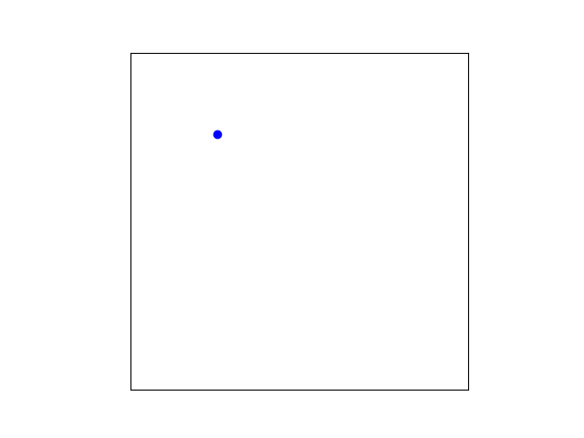
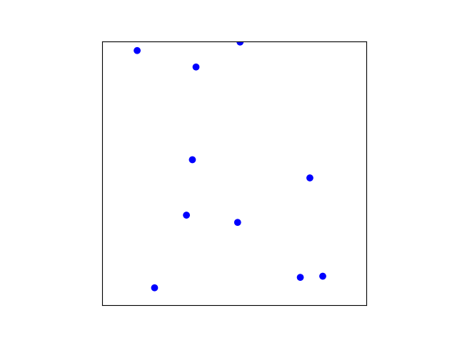
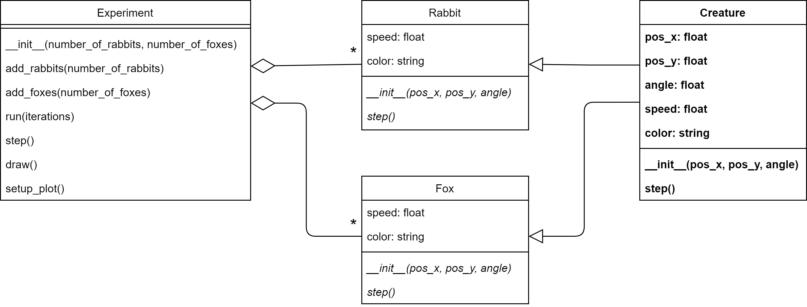
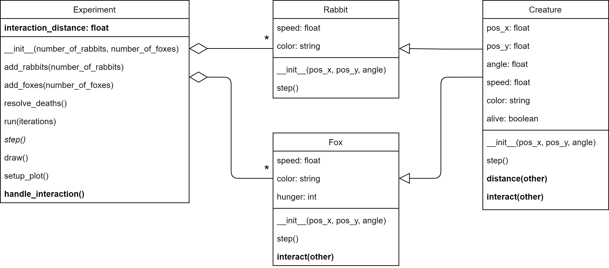
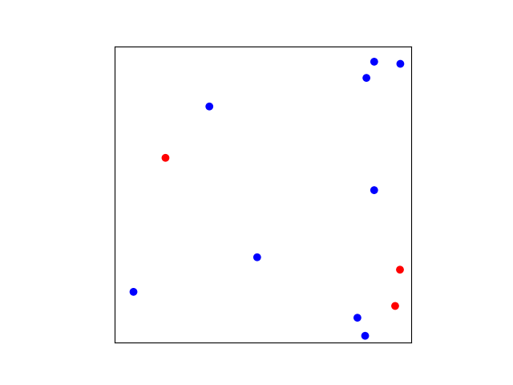

# Population

We want to know how a population of foxes and rabbits interact with each other. Specifically: *How does the birthrate of rabbits influence the population*.

## Background

A famous mathematical description of the interactions in the predator-prey model are the [Lotka-Volterra equations](https://en.wikipedia.org/wiki/Lotka–Volterra_equations). It is not important for you to know or understand these equations for this assignment. But if you're curious, here they are:

$$
\frac{dx}{dt} = \alpha x - \beta x y \\
\frac{dy}{dt} = \delta x y - \gamma y
$$

Where $x$ is the number of prey, $y$ the number of predators, $t$ time, and the other variables describe the interactions between species. Since this is a mathematical model and not the real world, the population of a species is allowed to be a floating point number.

We're not doing mathematics, but computer programming. So what we will do is simulate the behavior of predators (foxes) and preys (rabbits). Of course we will have to make a lot of simplifying assumptions to do so. In this assignment you will iteratively build up the system. We'll start out with something simple (a moving dot) and build it out to something more complex and interesting. The resulting model can be considered a [complex system](https://en.wikipedia.org/wiki/Complex_system#:~:text=Complex%20systems%20are%20systems%20whose,given%20system%20and%20its%20environment.). As such, you can rely on analyses that are common in that field such as [sensitivity analysis](https://en.wikipedia.org/wiki/Sensitivity_analysis).

### General goal

The simulation below shows the interaction between rabbits (blue) and foxes (red). They can both reproduce if they meet a creature of the same species. And the foxes can grow hungry, if they eat a rabbit, they can continue for longer. If they can't find a rabbit to eat they will eventually die.

As you see the foxes in this simulation use up all their resources (rabbits), which lead to the collapse of their ecosystem and eventually their own demise. You're going to find out if this can be prevented.

The simulation has a lot of moving (harr) parts. And is to complex to build in one go. In such cases it is good practice to start out with simple and gradually build it out to the desired result.

For the first part of this module we will specify exactly how to make an increasingly complex class structure in 9 phases. This might seem a bit restrictive, but it is a good way to learn how you can build complex object oriented projects.

## Phase 1: Rabbit
Start by download the file `phase1.py`. This will be the starting point for this assignment.

### Goal
Lets start out by having a single rabbit move over the screen. Like in the example below.

The blue dot represents a rabbit and it follows a straight path at a certain angle. When it hits the border it turns a 180 degrees around.

### Provided code

The file `phase1.py` you downloaded contains an `Experiment` class. This class contains the main functionality for displaying the rabbit and managing the experiment you're about to make. In this assignment you will iteratively extend the functionality of this class and add other classes.

The main code (below the `Experiment` class) creates a new rabbit with a specific position in the field ($$0.25$$, $$0.75$$) and a specific angle of movement ($$\pi/4$$). Than a new experiment is created containing this rabbit. And, as a last step, the experiment is run for a $$100$$ iterations. All done by these three lines:

    my_rabbit = Rabbit(0.25, 0.75, math.pi/4)
    my_experiment = Experiment(my_rabbit)
    my_experiment.run(100)

This would show the moving blue dot (the rabbit), where it not that you still have to implement the `Rabbit` class. The relation between the `Experiment` and `Rabbit` class is displayed in the following [UML](https://en.wikipedia.org/wiki/Unified_Modeling_Language) diagram:

In this diagram you see that an object of the class `Experiment` contains exactly one object of the class `Rabbit`. This is shown by the line that starts with the diamond shape and has the `1` written next to the `Rabbit` class. The diamond shape denotes aggregation (i.e., "contains") and the number denotes how many. So this translates to: "an experiment contains one rabbit".

The UML diagram also shows the methods and instance variables that the classes have. Everything that is written in bold, is up to you to implement.

So what you get is the class `Experiment`. This class contains the following:

* instance variable `size`. This is the size of the plot in pixels.
* the method `__init__(rabbit)`. This is called when you create a new experiment. So when you create new experiment you have to give it a rabbit object as an argument.
* the method `draw()`. This will draw the blue dot at the location of the rabbit.
* the method `step()`. This will call the `step()` method of the rabbit having it change it's location based on its speed and angle.
* the method `run(iterations)`. This will run the simulation/experiment by calling `step()` and `draw()` successively an `iteration` number of times.
* the method `setup_plot()`. This is called by `__init__()` and configures matplotlib for this experiment.

### Specification

What you still have to implement is the class `Rabbit`:

* **add** class `Rabbit`
* **add** instance variable `pos_x`, `pos_y`: The position of the rabbit. These are values between 0 and 1, where $$0, 0$$ is the left-bottom corner of the field and $$1, 1$$ is the right-upper corner.
* **add** instance variable `angle`: The angle at which the rabbit will move. An angle of 0 makes the rabbit move along the x-axis and an angle of $$\pi /2$$ makes the rabbit move along the y-axis.
* **add** instance variable `speed`: The speed at which the rabbit moves every step of the simulation ($$0.01$$ is a good value to start out with).
* **add** instance variable `color`: The color for displaying the rabbit in the plot. Rabbits get the color `'blue'`.
* **add** method `__init__(pos_x, pos_y, angle)`: The method automatically called when creating a new `Rabbit` object. When creating a new object, you have to provide the position and angle. The method should assign those to the appropriate instance variables. The init should also set the values for `speed` and `color`.
* **add** method `step()`: Run a single step of the simulation. This should update the position of the rabbit.
    The rate of change ($$dx$$ and $$dy$$) is given by the formulas:
    $$
    dx = \textrm{cos}(\textrm{angle}) \cdot \textrm{speed} \\
    dy = \textrm{sin}(\textrm{angle}) \cdot \textrm{speed}
    $$
    We can use these values to update the $$x$$ and $$y$$ position:
    $$
    \textrm{pos\_x} := \textrm{pos\_x} + dx \\
    \textrm{pos\_y} := \textrm{pos\_y} + dy
    $$
    There is a very important (literal) edge case: When the rabbit reaches the edge of the field (its x or y location is smaller than 0 or bigger than 1), it should not change its position but turn around (i.e., increase the angle by $$\pi$$).

## Phase 2: Rabbits
Before you continue, **make a copy of your previous file and call it `phase2.py`**. Make sure to **continue editing in this new file**. It is important to keep the previous file as is. For this module you'll have to submit all the stages separately.

### Goal

A single rabbit moving around is a bit boring, let's add some more. Like so:

The great thing of using classes is that we can make multiple instances of a specific class. So we can add multiple rabbits without modifying the `Rabbit` class and with only small modifications to the `Experiment` class.

After your changes the UML should look like this:

The fact that `Experiment` can contain any number of rabbits is indicated by the `*` near the `Rabbit` class on the aggregation line. In the UML everything that is bold is new (and is up to you to implement). So here you'll have to add the method `add_rabbits()`. Everything in italic is not new, but you will have to modify to make things work.

### Specification

For this phase you have to *modify* the class `Experiment` as follows:
* *modify* instance variable `rabbit` (of type `Rabbit`) to `rabbits` (of type `List`).
* **add** method `add_rabbits(number_of_rabbits)` that creates a list of rabbits with random locations and angles and adds them to the instance variable `rabbits`.
* *modify* `__init__(number_of_rabbits)` to accept the new parameter `number_of_rabbits` and use `add_rabbits()`. (From here on the `Rabbit` objects will be created *inside* the `Experiment` object. We don't have to do this in the main code anymore like we did in Phase 1.)
* *modify* method `step()` to call the `step()` method of *all* rabbits.
* *modify* method `draw()` to draw *all* rabbits.

## Phase 3: More natural movement
Before you continue, **make a copy of your previous file and call it `phase3.py`**. Make sure to **continue editing in this new file**. It is important to keep the previous file as is. For this module you'll have to submit all the stages separately.

### Goal

The straight lines that the rabbits walk don't feel particularly natural. Let's add some unpredictability to their movements. Let's have them change directions from time to time. Like this:

The resulting UML will be the same is in the previous step. You don't need to add any classes or methods. You'll just have to modify `step()` slightly.

### Specification

*Modifications* to the class `Rabbit`:

* *modify* method `step()` to get the rabbit to change angle regularly. The rabbit has a 20% chance to *update* its angle with a random value between $$-\pi/2$$ and $$\pi/2$$. So this is the change of angle relative to the current angle. The possible update of the angle should be done *before* taking a step.

## Phase 4: Foxes
Before you continue, **make a copy of your previous file and call it `phase4.py`**. Make sure to **continue editing in this new file**. It is important to keep the previous file as is. For this module you'll have to submit all the stages separately.

### Goal

Let's add the foxes to the experiment. For now they're just going to walk around and not bother any rabbits. Foxes are in many ways similar to rabbits, they have a position and an angle and they move around. But their movements are slightly different. They go faster and they make slower turns. We will give foxes the color red. The new simulation will look like this:

This will require a whole new class `Fox` as you can see in the UML:

You see that the class `Experiment` can contain any number of instances of `Fox` (as indicated by the `*`).

### Specification

For the class `Fox`:
* **add** class `Fox`. For now, it has the same properties as the `Rabbit`, only the speed and color have different values.
* **add** instance variables `pos_x`, `pos_y`.
* **add** instance variable `angle`.
* **add** instance variable `speed`. The speed of the fox should be $$0.03$$ (faster than the rabbit).
* **add** instance variable `color`. Foxes get the color `'red'`.
* **add** method `__init__(pos_x, pos_y, angle)`.
* **add** method `step()`. The steps are the same as for `Rabbit` only the change of angle is less abrupt: the angle has a 20% change of changing by a random value between $$-\pi/4$$ and $$\pi/4$$

For the class `Experiment`:
* *change* instance variable `rabbits` to `creatures`. This list will now contain both foxes and rabbits.
* **add** `add_foxes(number_of_foxes)` this should add foxes to the list of creatures.
* *modify* `__init__(number_of_rabbits, number_of_foxes)`. The method should now get an additional parameter for the amount of foxes. And it should call the method `add_foxes()`.
* *modify* `add_rabbits(number_of_rabbits)` to use the list `creatures` in stead of `rabbits`.
* *modify* `step()` to use the list `creatures` in stead of `rabbits`.
* *modify* `draw()` to use the list `creatures` in stead of `rabbits`.

## Phase 5: Creatures
Before you continue, **make a copy of your previous file and call it `phase5.py`**. Make sure to **continue editing in this new file**. It is important to keep the previous file as is. For this module you'll have to submit all the stages separately.

### Goal
Before adding more complexity again in the next phase, let's now focus on making the code a bit nicer.

As you might have realized by now, for the previous phase you created a lot of duplicate code. The class `Fox` and `Rabbit` have a lot of overlap. Not that surprising, since a big part of the code for both classes has to do with them being creatures that walk around in this simulated world.

So let's create an abstraction. You're going to create a superclass called `Creature`. This class will contain the walking around code that both `Fox` and `Rabbit` will inherit.

The UML will look like this:

Notice that class inheritance is indicated by the arrows. So `Fox` and `Rabbit` both inherit from `Creature`. You can also see that `Fox` and `Rabbit` are reduced a lot as most of their code will now reside in `Creature`.

### Specification

Create a new class called `Creature`. For this class:
* **add** instance variables `pos_x`, `pos_y`.
* **add** instance variable `angle`.
* **add** instance variable `speed`. Creatures get the default speed $$0.01$$.
* **add** instance variable `color`. Creatures get the default color `'black'`.
* **add** method `__init__(pos_x, pos_y, angle)`.
* **add** method `step()`. This method should only define the step based on the current angle, position and speed. It should not define the change of angle as that part is defined in the `step()` methods of the subclasses `Rabbit` and `Fox`

Modify the `Fox` class. You can remove a lot of code and inherit it from `Creature`.
* *modify* class `Fox`. The class definition should now be changed to inherit from `Creature`.
* *modify* method `__init__(pos_x, pos_y, angle)` to call the `__init__()` method from the super class (using `super()`). After this you should still specify `speed` and `color` in this class as those properties are particular to `Fox`.
* *modify* method `step()` to call the same method from the super class. Only the modification of the angle should remain in this class (as the logic for changing angles is particular to the `Fox` class).

Modify class `Rabbit` in the same way as `Fox`.

## Phase 6: Starving foxes
Before you continue, **make a copy of your previous file and call it `phase6.py`**. Make sure to **continue editing in this new file**. It is important to keep the previous file as is. For this module you'll have to submit all the stages separately.

### Goal

We need to give the foxes a reason to eat the rabbits. So let's make them hungry. We'll assume that hunger just linearly increases over time and that when Foxes are too hungry they die. Like so (notice the red dots disappearing):  

The red dots disappear all at once, because the foxes all come into existence at the same time, they get hungry at the same rate, they cannot feed yet (we have not implemented that part yet). So the foxes all tragically die of hunger at the exact same time.

As you can see in the UML bellow, you will have to add some methods and instance variables that have to do with managing creatures being alive or not and foxes being hungry:

Note that we chose to make being alive or not to be a property of `Creature`, not just of `Fox`. This is because we know that soon we want rabbits also be able to die so we might as well being alive or not a property of all creatures. Hunger, on the other hand is modelled as a property of only foxes, as at least for now, we will assume that rabbits don't need to eat.

### Specification

Modify the class `Creature`:

* **add** instance variable `alive`. This boolean registers if a creature is alive or not.
* *modify* method `__init__()` to set alive to its default value: `True`.

Modify the class `Fox`:

* **add** instance variable `hunger`. This is an integer indicating the degree of hunger of the fox (0 means no hunger at all).
* *modify* method `__init__()` to set hunger to 0.
* *modify* method `step()` to increase hunger by 1 at every step. Set alive to `False` once hunger is bigger than 80

Modify the class `Experiment`:

* **add** method `resolve_deaths()` that checks all creatures. If a creature is not `alive` it should be removed from the list of creatures.
* *modify* method `step()` to call `resolve_deaths()` at the end of every step.

## Phase 7: Feeding foxes
Before you continue, **make a copy of your previous file and call it `phase7.py`**. Make sure to **continue editing in this new file**. It is important to keep the previous file as is. For this module you'll have to submit all the stages separately.

### Goal

Now that the foxes can get hungry they'll have to be able to feed. The idea is that when a fox gets close enough to a rabbit he can eat it. The rabbit will then be removed from the experiment and the fox will not be hungry anymore. In the example below you see that when a red dot comes close to a blue dot, the blue dot disappears. As a result the red dots stay longer in the experiment.

The UML bellow shows the elements that we need to add. We need to be able to compute the *distance* between creatures and we need to have them *interact* when the distance is small enough. This requires modifications to all the classes. We add the `distance()` method to the `Creature` class as we need to be able to compute the distance between any type of creature, not only between foxes or rabbits. We add an `interact()` method to `Creature` as potentially any creature can interact with any other creature. Hover, for now this remains empty. As we only really implement the more specialize `interact()` method of the `Fox` class. Here we define what happens when a fox interacts with another creature. (If the other creature is a rabbit, the fox eats it.)

### Specification

Modify the class `Creature`:

* **add** method `distance(other)`. This should return the distance between the creature and another on.
* **add** method `interact(other)`. This method specifies what a creature should do when it is close enough to another creature. For now, nothing, so you can leave the method empty with `pass`

Modify the class `Fox`:

* **add** method `interact(other)`. This method specifies what a fox should do when it is close enough to another creature: If the other creature is a rabbit, the fox is not hungry anymore and the rabbit is killed.

Modify the class `Experiment`:

* **add** instance variable `interaction_distance`. This sets at which minimal distance two creatures can interact. A good distance is `0.05`.
* **add** method `handle_interaction()`. Test the distance between **every pair** of creatures. If the distance is lower than `interaction_distance`, call the `interact` from one of creature with the other creature as the argument. This method will likely be $$O(n^2)$$ complexity and thus the bottleneck of the simulation. If you want to simulate many creatures you would have to use fancier collision detection algorithms that have a lower time complexity, like [quadtrees](https://en.wikipedia.org/wiki/Quadtree). But don't do this now.
* *modify* method `step()` to call `handle_interaction()`.

## Phase 8: Reproduction

Before you continue, **make a copy of your previous file and call it `phase8.py`**. Make sure to **continue editing in this new file**. It is important to keep the previous file as is. For this module you'll have to submit all the stages separately.

### Goal

Now creatures can die because of hunger (foxes) or by being eaten (rabbits). Now we need to make sure they can reproduce. Every time a creature meats another creature of the same type, it will have a certain chance to reproduce. The change of reproduction is given by the particular birthrate of the type of creature.

It is important to not set the birthrate to high at the start. Reproduction is a exponential process and you can easily get an unmanageable explosion of creatures at a high birthrate. The experiment below runs with a $$0.15$$ birthrate for both foxes and rabbits.

The UML below shows the required modifications.

Every create has a birthrate. The `Creature` class defines its own default birthrate, but each type (`Fox` and `Rabbit`) also defines its own particular birthrate. There are also some modifications to handle the actual reproduction: The `Creature` class has a boolean `reproduce` to flag that it needs to be copied. And the `Experiment` class has a method `resolve_reproduction()` to manage the actual copying of instances when needed.

### Specification

Modify the class `Creature`:

* **add** instance variable `birthrate`. This `float` indicates how likely it is that two creatures that interact will reproduce. This is the default birthrate for any creature. Value 0 means the creature will never reproduce, and 1 means that the creature will reproduce at every interaction. The value is not super important as both `Fox` and `Rabbit` will define their own birthrate.
* **add** instance variable `reproduce`
* *modify* the method `__init__()`. Set `reproduce` to `False`
* *modify* the method `interact()`. Every time two creatures of the same kind interact, with a probability of `birthrate`, set `reproduce` to `True.`

Modify the class `Fox`:

* **add** instance variable `birthrate`. The initial birthrate of foxes is 0.15.
* *modify* method the `__init__()`. Set birthrate.

Modify the class `Rabbit`:

* **add** instance variable `birthrate`. The initial birthrate of rabbits is 0.15.
* *modify* method the `__init__()`. Set birthrate.

Modify the class `Experiment`:

* **add** method `resolve_reproduction()`. This method checks all creatures. If a creature is marked for reproduction, add another creature of the same type to the experiment at a random location and angle. Make sure to unmark the creature for reproduction. Otherwise it would start making endless copies.
* *modify* method `step()` to call `resolve_reproduction()`.

## Experiment 1: Stable population

Make a copy of your previous file and call it `experiment1.py`. Make sure to continue editing in this new file. It is important to keep the previous file as is. For this module you'll have to submit all the stages separately.

### Goal

Let's do a first real experiment. You're going to track the size of both the populations over time (iterations), like in the example below:

As you can see here, the population of rabbits is not stable. The rabbits die out at around iteration 100. Your goal is to set the birthrate of foxes to 0.05 and find a birthrate of rabbits that makes the population relatively stable (there are always between 10 and 50 rabbits in the system for at least 200 iterations).

### Setup

You will still need to modify the classes to be able to run this experiment, but we're not going to spell out how to do it. It's up to your own design now.

One of the things to account for is the exponential population growth. Since the reproduction is an exponential process, if there are too many rabbits for the foxes to keep up, they will overrun the system and their numbers will explode. The easiest way to deal with that is by putting a cap on the total number of rabbits. So we don't ever allow more than 100 rabbits to exist at the same time. (Putting a cap on the foxes is less important as they will only be able to grow in numbers when there are plenty sheep.)

We also want to have a timeline plot that monitors the amount of rabbits and foxes in the system. Like in the example here bellow.

### Specification

So to run the experiment you have to change the following:

* Add a way to set a maximum amount of rabbits.
* Create a second subplot that shows a timeline of the rabbits and foxes. You can create a second subplot like so:

        self.fig, (self.ax1, self.ax2) = plt.subplots(2)

    You can then plot using the `ax2` like this:

        self.ax2.plot(iterations_list, fox_history, color='red')

    Where for `iterations_list` and `fox_history` you have to fill in your own data.

    Don't forget to clear the plot in the same way you clear the plot of `ax1`:

        self.ax2.cla()

    These two changes might require some refactoring of your code and/or additional methods and instance variables. It's up to you to decide how to implement this. But you might want at least to have an additional method that allows you to count creature of a specific type in the experiment.
* Draw a new UML diagram of your update and save this as `experiment1-uml.png`. You can hand draw it and take a photo if you want.
* Run the experiment (a decent number of times). What seems a good growth rate for the rabbits?

## Experiment 2: Hungry bunnies

Make a copy of your previous file and call it `experiment2.py`. Make sure to continue editing in this new file. It is important to keep the previous file as is. For this module you'll have to submit all the stages separately.

### Goal

Having an hard cap on the number of rabbits is a very artificial solution. Now, the experiment is never 100% realistic (and that's often also not what you'd want), but it's not difficult to come up with a slightly more elegant solution. The reason foxes don't need a cap is because they have a limited food source. We can do the same for the rabbits.

### Specification

* Create a new food source for the rabbits. (This can be anything: grass, carrots, Easter eggs). The only requirement is that the source has to be limited, but renewable (e.g., grass that slowly grows back).

* Create an UML diagram for this experiment `experiment2-uml.png`. You can hand draw it and take a photo if you want.

* You would expect that the population stays stable for a much wider range of birthrates with this adaptation. Try to see if this is the case and document your findings in the comments.

* Feel free to change the class structure as much as you need. Try to generalize using inheritance as much as possible/makes sense

## Experiment 3: Go nuts

Make a copy of your previous file and call it `experiment3.py`. Make sure to continue editing in this new file. It is important to keep the previous file as is. For this module you'll have to submit all the stages separately.

### Specification

* Be creative: add an interesting new element to the simulation and see how it changes the dynamics.

## Sensitivity Analysis ???

TODO. Wouter?
